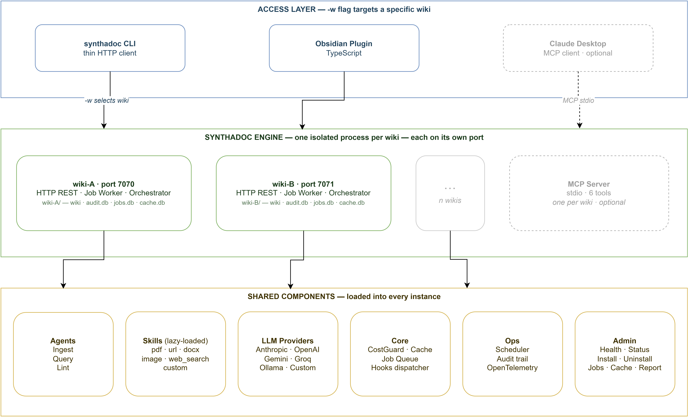

# Synthadoc

```
      .-+###############+-.
    .##                   ##.
   ##    .----.   .----.    ##
  ##    /######\ /######\    ##
  ##    |######| |######|    ##
  ##    | [SD] | | wiki |    ##
  ##    |######| |######|    ##
  ##    \######/ \######/    ##
   ##    '----'   '----'    ##
    '##                   ##'
      '-+###############+-'

  S Y N T H A D O C  0.1.0
  ────────────────────────────────
  Domain-agnostic LLM wiki engine
```

**Domain-agnostic LLM knowledge compilation engine.**

> Built for individuals, small teams, and large organizations who need a knowledge base that stays accurate as documents accumulate.

Synthadoc reads your raw source documents — PDFs, spreadsheets, web pages, images, Word files — and uses an LLM to synthesize them into a persistent, structured wiki. Cross-references are built automatically, contradictions are detected and surfaced, orphan pages are flagged, and every answer cites its sources. The result lives as plain Markdown in a local folder that opens directly in [Obsidian](https://obsidian.md).

---

## Who Is It For?

Synthadoc scales from a single researcher to a company-wide knowledge platform:

| Team size | Typical use case |
|-----------|-----------------|
| **Solo / 1–2 people** | Personal research wiki, freelance knowledge base, indie hacker documentation — run it free on Gemini Flash or a local Ollama model with zero ongoing cost |
| **Small team (3–20)** | Shared internal wiki for a startup or department; each member ingests from their own sources; the shared wiki stays consistent and contradiction-free |
| **Medium / enterprise** | Compliance-sensitive knowledge bases that must stay local; per-department wikis on separate ports; audit trail for every ingest and cost event; hook system for CI/CD integration; OpenTelemetry for ops dashboards |

No cloud account. No vendor lock-in. The wiki is plain Markdown — open it in any editor, back it up with git, sync it with any cloud drive.

---

## Inspiration and Vision

> *"The LLM should be able to maintain a wiki for you."*
> — Andrej Karpathy, [LLM Wiki gist](https://gist.github.com/karpathy/442a6bf555914893e9891c11519de94f)

Most knowledge-management tools retrieve and summarize at query time. Synthadoc inverts this: it **compiles knowledge at ingest time**. Every new source enriches and cross-links the entire corpus, not just appends a new chunk. The wiki is the artifact — readable, editable, and browsable without any tool running.

**Long-term alignment:**

| Direction | How Synthadoc moves there |
|-----------|--------------------------|
| Agent orchestration | Orchestrator dispatches parallel IngestAgent, QueryAgent, LintAgent sub-agents with cost guards and retry backoff |
| Sub-agent skills/plugins | 3-tier lazy-load skill system; drop a Python file in `skills/` to add a new file format without touching the core |
| LLM wiki vs. RAG | Pre-compiled structured knowledge beats query-time synthesis for contradiction detection, graph traversal, and offline access |
| CLI / HTTP | CLI and HTTP REST API cover every integration path — ingest, query, lint, audit, and job management |
| Local-first | All data stays on your machine; localhost-only network binding; no cloud dependency except the LLM API itself |
| Provider choice | Five LLM backends including free-tier Gemini and Groq — no single-vendor dependency |

---

## Problems Addressed

### 1. RAG conflates contradictions; Synthadoc surfaces them

When two sources disagree, vector search returns both and the LLM silently blends them. Synthadoc detects the conflict during ingest, flags the page with `status: contradicted`, preserves both claims with citations, and either auto-resolves (if confidence ≥ threshold) or queues the conflict for human review.

### 2. Knowledge fragments; Synthadoc links it

RAG chunks are isolated. Synthadoc builds `[[wikilinks]]` between related pages during every ingest pass. The resulting graph is visible in Obsidian's Graph view and queryable with Dataview.

### 3. Orphan knowledge has no address; Synthadoc finds it

Pages that exist but are referenced by nothing are surfaced by the lint system, with ready-to-paste index entries so you can quickly integrate them.

### 4. Re-synthesis is expensive; Synthadoc caches it

A 3-layer cache (embedding, LLM response, provider prompt cache) means repeated lint runs on unchanged pages cost near-zero tokens.

### 5. Knowledge is locked in tools; Synthadoc escapes it

Every page is a plain Markdown file with YAML frontmatter. No proprietary format. Open the folder in any editor, put it in git, sync it with any cloud drive.

### Business values

| Value | How |
|-------|-----|
| **Faster onboarding** | New team members query the wiki instead of digging through documents |
| **Audit trail** | Every ingest recorded in `audit.db` with source hash, token count, and timestamp |
| **Cost control** | Configurable soft-warn and hard-gate thresholds; 3-layer cache reduces repeat spend |
| **Compliance** | Local-first — source documents and compiled knowledge never leave your machine |
| **Extensibility** | Hooks fire on every event; custom skills load without a server restart |

---

## Why Synthadoc?

### Competitive advantages

| Capability | Synthadoc | Typical RAG | NotebookLM | Notion AI |
|------------|-----------|-------------|------------|-----------|
| Ingest-time synthesis | **Yes** | No | Partial | No |
| Contradiction detection | **Yes** | No | No | No |
| Orphan page detection | **Yes** | No | No | No |
| Persistent wikilink graph | **Yes** | No | No | No |
| Local-first (no cloud data) | **Yes** | Varies | No | No |
| Custom skill plugins | **Yes** | Limited | No | No |
| Obsidian integration | **Yes** | No | No | No |
| Cost guard + audit trail | **Yes** | No | No | No |
| Hook / CI integration | **Yes** (2 events) | No | No | No |
| Offline browsable artifact | **Yes** | No | No | No |
| Multi-wiki isolation | **Yes** | No | No | No |
| Web search → wiki pages | **Yes** | No | No | No |
| Free LLM tier support | **Yes** (Gemini, Groq) | No | No | No |
| Auto wiki overview page | **Yes** | No | No | No |
| Resumable job queue + retry | **Yes** | No | No | No |

### Key differentiators vs. RAG

RAG chunks documents and retrieves them at query time. Synthadoc **compiles** knowledge: every new source is synthesized into the existing wiki graph at ingest time.

- **Contradictions are caught, not blended.** When two sources disagree, Synthadoc flags the page — RAG silently averages both claims.
- **Knowledge is linked, not scattered.** `[[wikilinks]]` connect related pages into a navigable graph visible in Obsidian and queryable with Dataview.
- **The artifact outlives the tool.** Close the server, open the wiki folder in any Markdown editor — the knowledge is all there, human-readable, no proprietary format.
- **Cost-efficient at scale.** Two-step ingest with cached analysis means repeated ingest of similar sources costs near-zero tokens. Three cache layers stack for lint and query too.
- **Ingest is durable, not fragile.** Every ingest request becomes a queued job with automatic retry and a persistent audit record. Batch a hundred documents and resume after a crash — no work is lost.

---

## Architecture



For full architecture details, data models, API reference, and plugin development guide see **[docs/design.md](docs/design.md)**.

---

## What's Included in v0.1

- **3 agents** — IngestAgent (two-step cached synthesis), QueryAgent (BM25 + LLM), LintAgent (contradiction + orphan detection + auto-resolution)
- **8 built-in skills** — PDF, URL, Markdown/TXT, DOCX, PPTX, XLSX/CSV, Image (vision), **Web search (Tavily — fully live)**
- **Folder-based skill system** — each skill is a self-contained folder with a `SKILL.md` manifest; intent-based dispatch alongside extension matching; drop a folder in `skills/` to add a new format without touching core code
- **2 access surfaces** — CLI (thin HTTP client), HTTP REST API
- **Obsidian plugin** — ingest (with file picker when no note is active), query (responsive modal, stays open), lint report, jobs list — all from the command palette; ribbon shows engine health + page count
- **5 LLM providers** — Anthropic, OpenAI, **Gemini** (free tier), **Groq** (free tier), Ollama (local); switch with one config line
- **Two-step ingest** — `_analyse()` caches entity extraction + summary; decision prompt uses summary instead of full text; reduces cost on large documents
- **purpose.md scope filtering** — define what belongs in your wiki; the LLM skips out-of-scope sources cleanly
- **overview.md auto-summary** — 2-paragraph wiki overview regenerated automatically after every ingest that creates or updates pages
- **Audit CLI** — `synthadoc audit history / cost / events` query `audit.db` without needing direct access; `--analyse-only` flag previews ingest analysis before writing pages
- **3-layer cache** — embedding cache, LLM response cache, provider prompt cache
- **Cost guards** — configurable soft-warn and hard-gate USD thresholds
- **Hook system** — shell commands on `on_ingest_complete` and `on_lint_complete` lifecycle events; blocking or background; context passed as JSON on stdin; community hook library in [`hooks/`](hooks/)
- **Job queue** — SQLite-backed, persistent, retry with exponential backoff; non-retryable errors (`failed`) distinguished from exhausted-retry errors (`dead`)
- **Startup banner** — ASCII logo with version, port, wiki, and PID on `synthadoc serve`; plain-text version served at `GET /`; `--background` flag detaches the server and returns the shell immediately (logs → file only)
- **Multi-wiki** — unlimited isolated wikis, each on its own port
- **OpenTelemetry** — traces, metrics, structured logs; OTLP export optional
- **Cross-platform** — Windows, Linux, macOS

---

## Installation

### Prerequisites

| Requirement | Version | Notes |
|-------------|---------|-------|
| Python | 3.11+ | |
| Node.js | 18+ | Obsidian plugin build only |
| Git | any | |
| LLM API key | — | At least one required (see below) |
| Tavily API key | — | Optional — web search feature only |

**LLM API key — at least one required:**

| Provider | Free tier | Get key |
|----------|-----------|---------|
| **Gemini Flash** | Yes — 15 RPM / 1M tokens/day, no credit card | [aistudio.google.com](https://aistudio.google.com/app/apikey) |
| Groq | Yes — rate-limited | [console.groq.com](https://console.groq.com/keys) |
| Ollama | Yes — runs locally, no key | [ollama.com](https://ollama.com) |
| Anthropic | No | [console.anthropic.com](https://console.anthropic.com/) |
| OpenAI | No | [platform.openai.com](https://platform.openai.com/api-keys) |

**Tavily API key (optional — enables web search):**
Get a free key at [tavily.com](https://tavily.com). Without it, web search jobs will fail but all other features work normally.

---

### Step 1 — Clone and install

```bash
git clone https://github.com/paulmchen/synthadoc.git
cd synthadoc
pip install -e ".[dev]"
```

### Step 2 — Run the Python test suite

Validate that the Python engine builds and all tests pass before proceeding:

```bash
pytest --ignore=tests/performance/ -q
```

Expected: all tests pass, 0 failures. If any fail, check the error output before continuing.

Performance benchmarks (optional — Linux/macOS, measures SLOs):

```bash
pytest tests/performance/ -v --benchmark-disable
```

### Step 3 — Build and test the Obsidian plugin

```bash
cd obsidian-plugin
npm install
npm run build    # produces main.js
npm test         # runs Vitest unit tests
cd ..
```

### Step 4 — Set your API keys

```bash
# macOS / Linux — add to ~/.bashrc or ~/.zshrc to persist
export GEMINI_API_KEY=AIza…          # free tier — recommended starting point
export ANTHROPIC_API_KEY=sk-ant-…    # if using Anthropic
export TAVILY_API_KEY=tvly-…         # optional — web search only

# Windows cmd — current session
set GEMINI_API_KEY=AIza…
set TAVILY_API_KEY=tvly-…

# Windows cmd — permanent (open a new cmd window after running)
setx GEMINI_API_KEY AIza…
setx TAVILY_API_KEY tvly-…
```

### Step 5 — Verify

```bash
synthadoc --version
```

### Step 6 — Install a demo wiki, then start the engine

A wiki must be installed before the engine can serve it. The fastest way to get started is the **History of Computing** demo, which ships with 10 pre-built pages and sample source files — no LLM API key required to browse it.

**Install the demo wiki:**

```bash
# Linux / macOS
synthadoc install history-of-computing --target ~/wikis --demo

# Windows (cmd.exe)
synthadoc install history-of-computing --target %USERPROFILE%\wikis --demo
```

**Then start the engine:**

```bash
# Foreground — keeps the terminal; logs stream to the console
synthadoc serve -w history-of-computing

# Background — releases the terminal; logs go to the wiki log file
synthadoc serve -w history-of-computing --background
```

The server binds to `http://127.0.0.1:7070` by default (port is set in `<wiki-root>/.synthadoc/config.toml`). Leave it running while you work — the Obsidian plugin, CLI ingest commands, and query commands all talk to it.

To stop a background server:

```bash
# Linux / macOS
kill <PID>

# Windows (cmd)
taskkill /PID <PID> /F
```

The PID is printed when the background server starts and saved to `<wiki-root>/.synthadoc/server.pid`.

---

## Quick-Start Guide

The **History of Computing** demo includes 10 pre-built pages, raw source files covering clean-merge, contradiction, and orphan scenarios, and a full walkthrough of every Synthadoc feature.

**Full step-by-step walkthrough: [docs/demo-guide.md](docs/demo-guide.md)**

The guide covers:
1. Installing the demo vault and opening it in Obsidian
2. Installing the Dataview and Synthadoc plugins
3. Starting the engine and querying pre-built content
4. Running batch ingest across all demo sources
5. Resolving a contradiction (manual and LLM auto-resolve)
6. Fixing an orphan page
7. Web search ingestion, audit commands, hooks, and scheduling

---

## Creating Your Own Wiki

Once you've walked through the demo, creating a wiki for your own domain takes two commands:

```bash
# "market-condition-canada" is the wiki name (used in all -w commands)
# "Market conditions and trends in Canada" is the subject domain the wiki will manage
synthadoc install market-condition-canada --target ~/wikis --domain "Market conditions and trends in Canada"
synthadoc serve -w market-condition-canada
```

`--target` is the parent folder where the wiki directory will be created. `--domain` is a free-text description of the subject area — the LLM uses it to tailor the scaffold content to your domain.

**Then open the wiki in Obsidian as a new vault** and install both plugins — each wiki is an independent vault, so this is required once per wiki:

1. Open Obsidian → **Open folder as vault** → select the wiki folder (e.g. `~/wikis/market-condition-canada`)
2. **Settings → Community plugins → Turn on community plugins → Browse** → install and enable **Dataview**
3. Install and enable **Synthadoc** (or copy the plugin from an existing vault's `.obsidian/plugins/` folder)

`install` creates the folder structure and, if an API key is set, runs a one-time LLM scaffold that generates four domain-aware starter files:

| File | Purpose |
|---|---|
| `wiki/index.md` | Table of contents — organises pages into domain-relevant categories with `[[wikilinks]]` |
| `wiki/purpose.md` | Scope declaration — tells the ingest agent what belongs in this wiki and what to ignore |
| `AGENTS.md` | LLM behaviour guidelines — domain-specific instructions for tone, terminology, and synthesis style |
| `wiki/dashboard.md` | Live Dataview dashboard — orphan pages, contradictions, and page count (requires Obsidian + Dataview plugin) |

These files are the wiki's "self-knowledge" — Synthadoc reads them on every ingest to decide how to classify, merge, and label new content for that domain.

**Scaffold can be re-run at any time** as your domain evolves. Pages already linked in `index.md` are protected and never overwritten:

```bash
synthadoc scaffold -w market-condition-canada
```

From this point the workflow is the same as the demo: drop source files into `raw_sources/`, run `synthadoc ingest --batch raw_sources/ -w market-condition-canada`, query, lint, and let the wiki grow.

See [docs/design.md](docs/design.md) for a full description of how ingest, contradiction detection, and orphan tracking work under the hood.

---

## Configuration

> **You do not need to configure anything to run the demo.** The demo wiki
> ships with its own settings and sensible built-in defaults cover everything
> else. Set your API key env var, run `synthadoc serve`, and go.
>
> Read this section when you are ready to run a real wiki or change a default.

### How configuration works

Settings are resolved in three layers — later layers win:

```
1. Built-in defaults          (always applied)
2. ~/.synthadoc/config.toml   (global — your preferences across all wikis)
3. <wiki-root>/.synthadoc/config.toml   (per-project — overrides for one wiki)
```

Neither file is required. If both are absent, the built-in defaults take effect.

### Global config — `~/.synthadoc/config.toml`

**Use this to set preferences that apply to every wiki on your machine** —
primarily your default LLM provider and the wiki registry.

```toml
[agents]
default = { provider = "gemini", model = "gemini-2.0-flash" }  # free tier
lint    = { provider = "groq",   model = "llama-3.3-70b-versatile" }  # cheaper for lint

[wikis]
research = "~/wikis/research"
work     = "~/wikis/work"
```

Common reason to edit: switching from the Anthropic default to Gemini Flash
(free tier) so all wikis use it without touching each project config.

### Per-project config — `<wiki-root>/.synthadoc/config.toml`

**Use this when one wiki needs different settings from the global default** —
a different port, tighter cost limits, wiki-specific hooks, or web search.

```toml
[server]
port = 7071          # required if running more than one wiki simultaneously

[cost]
soft_warn_usd = 0.50
hard_gate_usd = 2.00

[web_search]
provider    = "tavily"
max_results = 20

[hooks]
on_ingest_complete = "python git-auto-commit.py"
```

Common reason to edit: each wiki needs its own port when running multiple
wikis at the same time.

Full config reference: [docs/design.md — Configuration](docs/design.md#configuration).

---

## Command Reference by Use Case

### Setting up a wiki

```bash
# Create a new empty wiki (LLM scaffold runs automatically if API key is set)
synthadoc install my-wiki --target ~/wikis --domain "Machine Learning"

# Create a wiki on a specific port (useful when running multiple wikis)
synthadoc install my-wiki --target ~/wikis --domain "Machine Learning" --port 7071

# Install the demo (includes pre-built pages and raw sources — no LLM call needed)
synthadoc install history-of-computing --target ~/wikis --demo

# List available demo templates
synthadoc demo list
```

### Refreshing wiki scaffold

After install, you can re-run the LLM scaffold at any time to regenerate domain-specific content (index categories, AGENTS.md guidelines, purpose.md scope). Pages already linked in `index.md` are protected and preserved.

```bash
# Regenerate scaffold for an existing wiki
synthadoc scaffold -w my-wiki

# Schedule weekly refresh (runs every Sunday at 4 AM)
synthadoc schedule add --op "scaffold" --cron "0 4 * * 0" -w my-wiki
```

`config.toml` and `dashboard.md` are never modified by `scaffold`.

### Running the server

```bash
# Start HTTP API + job worker (foreground — terminal stays attached)
synthadoc serve -w my-wiki

# Detach to background — banner shown, then shell is released
# All logs go to <wiki>/.synthadoc/logs/synthadoc.log
synthadoc serve -w my-wiki --background

# Custom port
synthadoc serve -w my-wiki --port 7071

# Verbose debug logging to console
synthadoc serve -w my-wiki --verbose
```

### Ingesting sources

```bash
# Single file or URL
synthadoc ingest report.pdf -w my-wiki
synthadoc ingest https://example.com/article -w my-wiki

# Entire folder (parallel, up to max_parallel_ingest at a time)
synthadoc ingest --batch raw_sources/ -w my-wiki

# Manifest file — ingest a curated list of sources in one shot.
# sources.txt: one entry per line; each line is either an absolute file path
# (PDF, DOCX, PPTX, MD, …) or a URL. Blank lines and # comments are ignored.
# Each entry becomes a separate job in the queue, processed sequentially.
#
# Example sources.txt:
#   /home/user/docs/research-paper.pdf
#   /home/user/slides/keynote.pptx
#   https://en.wikipedia.org/wiki/Alan_Turing
#   # this line is ignored
synthadoc ingest --file sources.txt -w my-wiki

# Force re-ingest (bypass deduplication and cache)
synthadoc ingest --force report.pdf -w my-wiki
```

### Querying

```bash
# Ask a question — answer cites wiki pages
synthadoc query "What is Moore's Law?" -w my-wiki

# Save the answer as a new wiki page
synthadoc query "What is Moore's Law?" --save -w my-wiki
```

### Linting

```bash
# Run a full lint pass (enqueues job)
synthadoc lint run -w my-wiki

# Only contradictions
synthadoc lint run --scope contradictions -w my-wiki

# Auto-apply high-confidence resolutions
synthadoc lint run --auto-resolve -w my-wiki

# Instant report (reads wiki files directly, no server needed)
synthadoc lint report -w my-wiki
```

### Monitoring jobs

```bash
# List all jobs (most recent first)
synthadoc jobs list -w my-wiki

# Filter by status
synthadoc jobs list --status pending -w my-wiki
synthadoc jobs list --status failed -w my-wiki
synthadoc jobs list --status dead -w my-wiki

# Single job detail
synthadoc jobs status <job-id> -w my-wiki

# Retry a dead job
synthadoc jobs retry <job-id> -w my-wiki

# Remove old records
synthadoc jobs purge --older-than 30 -w my-wiki
```

### Inspecting ingest results

```bash
# Preview how a source will be analysed without writing pages
synthadoc ingest report.pdf --analyse-only -w my-wiki
# → {"entities": [...], "tags": [...], "summary": "..."}
```

### Audit trail

```bash
# Ingest history: timestamp, source file, wiki page, tokens, cost
synthadoc audit history -w my-wiki            # last 50 records
synthadoc audit history -n 100 -w my-wiki     # last 100 records
synthadoc audit history --json -w my-wiki     # raw JSON for scripting

# Token usage: totals + daily breakdown (cost always $0.0000 in v0.1)
synthadoc audit cost -w my-wiki               # last 30 days
synthadoc audit cost --days 7 -w my-wiki      # last 7 days

# Audit events: contradictions found, auto-resolutions, cost gate triggers
synthadoc audit events -w my-wiki             # last 100 events
synthadoc audit events --json -w my-wiki      # raw JSON for scripting
```

### Scheduling recurring jobs

```bash
# Register a nightly ingest
synthadoc schedule add --op "ingest --batch raw_sources/" --cron "0 2 * * *" -w my-wiki

# Weekly lint
synthadoc schedule add --op "lint" --cron "0 3 * * 0" -w my-wiki

# List scheduled jobs
synthadoc schedule list -w my-wiki

# Remove a scheduled job
synthadoc schedule remove <id> -w my-wiki
```

### Removing a wiki

Stop the server for that wiki before uninstalling — the serve process must not be running
when the directory is deleted.

```bash
# Stop the background server (PID is in <wiki-root>/.synthadoc/server.pid)
kill $(cat ~/wikis/my-wiki/.synthadoc/server.pid)          # Linux / macOS
taskkill /PID <pid> /F                                      # Windows

# Then uninstall — two-step confirmation required, no --yes escape
synthadoc uninstall my-wiki
```

---

## Administrative Reference

### Health and status

```bash
# Wiki statistics: pages, queue depth, cache hit rate
synthadoc status -w my-wiki

# Liveness probe (useful in scripts and monitoring)
# Port is per-wiki — check [server] port in <wiki-root>/.synthadoc/config.toml
# Default is 7070; each additional wiki uses its own port (7071, 7072, …)
curl http://127.0.0.1:7070/health
```

Expected `status` output:
```
Wiki:         /home/user/wikis/my-wiki
Pages:        34
Jobs pending: 0
Jobs total:   12
```

### Logs

Synthadoc writes three log artefacts per wiki:

| File | Location | Format | Use |
|------|----------|--------|-----|
| `log.md` | `<wiki-root>/log.md` | Human-readable Markdown | Read inside Obsidian; shows every ingest, contradiction, lint event |
| `synthadoc.log` | `<wiki-root>/.synthadoc/logs/` | JSON lines (rotating) | Structured debug/ops log; grep or pipe to jq |
| `audit.db` | `<wiki-root>/.synthadoc/audit.db` | SQLite (append-only) | Source hashes, cost records, job history |

**Tailing the JSON log:**

```bash
# Tail and pretty-print with jq
tail -f .synthadoc/logs/synthadoc.log | jq .

# Filter to errors only
tail -f .synthadoc/logs/synthadoc.log | jq 'select(.level == "ERROR")'

# Filter to a specific job
# job_id is present only on records logged in job context (ingest/lint workers)
tail -f .synthadoc/logs/synthadoc.log | jq 'select(.job_id == "abc123")'
```

**Log rotation:** When `synthadoc.log` reaches `max_file_mb`, it is renamed to `synthadoc.log.1`; the previous `.1` becomes `.2`; files beyond `backup_count` are deleted. Total disk ≈ `max_file_mb × (backup_count + 1)`.

**Changing log level at runtime:** Edit `[logs] level` in `.synthadoc/config.toml` and restart `synthadoc serve`. Or pass `--verbose` to get `DEBUG` for one session without editing config.

### Audit trail

```bash
synthadoc audit history -w my-wiki          # table: timestamp, source file, wiki page, tokens, cost
synthadoc audit history -n 100 -w my-wiki   # last 100 records (default 50)
synthadoc audit history --json -w my-wiki   # raw JSON for scripting

synthadoc audit cost -w my-wiki             # total tokens + daily breakdown, last 30 days
synthadoc audit cost --days 7 -w my-wiki    # weekly view
synthadoc audit cost --json -w my-wiki      # {total_tokens, total_cost_usd, daily: [...]}

synthadoc audit events -w my-wiki           # table: timestamp, job_id, event type, metadata
synthadoc audit events --json -w my-wiki    # raw JSON
```

> **Note:** `cost_usd` is always `$0.0000` in v0.1 — per-model pricing is not yet implemented. Token counts are accurate.

### Cache management

```bash
# Remove all cached LLM responses
# Output: "Cache cleared: N entries removed."
synthadoc cache clear -w my-wiki
```

Cache invalidation happens automatically when:
- A source file's SHA-256 hash changes (content changed)
- `CACHE_VERSION` is bumped in `core/cache.py` (after prompt template edits)
- `--force` is passed to ingest

### OpenTelemetry integration

By default, traces and metrics are written to `<wiki-root>/.synthadoc/logs/traces.jsonl`. To send to any OTLP backend (Jaeger, Grafana Tempo, Honeycomb, Datadog):

```toml
# ~/.synthadoc/config.toml
[observability]
exporter      = "otlp"
otlp_endpoint = "http://localhost:4317"
```

### Debugging

```bash
# Start server with DEBUG console logging
synthadoc serve -w my-wiki --verbose

# Check for configuration problems
synthadoc status -w my-wiki     # prints pre-flight warnings

# View recent job failures
synthadoc jobs list --status failed -w my-wiki
synthadoc jobs status <job-id> -w my-wiki    # shows error message + traceback

# Force a re-ingest to rule out cache issues
synthadoc ingest --force problem.pdf -w my-wiki
```

---

## Understanding Logs and the Audit Trail

### `log.md` — the human log

Every significant event is appended as a Markdown entry:

```markdown
## 2026-04-10 14:32 | INGEST | constitutional-ai.pdf
- Created: ['constitutional-ai']
- Updated: ['ai-alignment-overview']
- Flagged: ['reward-hacking']
- Tokens: 4,820 | Cost: $0.0000 | Cache hits: 3
```

Open `log.md` in Obsidian to browse and search the full history.

### `synthadoc.log` — the structured log

JSON lines format. Each record:

```json
{
  "ts": "2026-04-10T14:32:01",
  "level": "INFO",
  "logger": "synthadoc.agents.ingest_agent",
  "msg": "Page created: alan-turing",
  "job_id": "abc123",
  "operation": "ingest",
  "wiki": "history-of-computing"
}
```

Standard fields: `ts`, `level`, `logger`, `msg`. Job-scoped fields (added by `get_job_logger`): `job_id`, `operation`, `wiki`. Future: `trace_id` for OTel correlation.

Log levels follow RFC 5424:

| Level | Used for |
|-------|----------|
| DEBUG | LLM prompt/response bodies, cache keys, BM25 scores |
| INFO  | Job start/complete, page created/updated, server started |
| WARNING | Soft failures (network unreachable), cache miss spikes |
| ERROR | Job failed, LLM API error, file write failed |
| CRITICAL | Server cannot start (port conflict, missing key, bad wiki root) |

### `audit.db` — the immutable record

SQLite, append-only. Records: every ingest (source path, SHA-256, cost, timestamp), every cost threshold crossing, every auto-resolution applied, every job that died. Never modified; only `jobs purge` deletes records older than a threshold.

---

## Customization

### Adding a custom skill (new file format)

Skills tell Synthadoc how to extract text from a source it doesn't understand out of the box. Add one when you have a proprietary or domain-specific format:

| You have | Skill you'd write |
|----------|------------------|
| Notion workspace export (`.zip`) | Unzip, walk pages, strip Notion-specific markup |
| Confluence space export (`.xml`) | Parse XML, extract page bodies and metadata |
| Slack export archive | Walk channels/messages JSON, format as conversation transcript |
| Internal `.docx` template with custom fields | Strip template boilerplate, extract only the filled-in sections |
| API endpoint or internal database | Fetch records, render as structured Markdown |
| Proprietary binary format (CAD, ERP data) | Convert to text using a vendor SDK, return plain content |

Skills are Apache-2.0 licensed — no AGPL obligation on your own skill code.

1. Create `<wiki-root>/skills/my_format.py` (or `~/.synthadoc/skills/` for global availability).
2. Subclass `BaseSkill` (Apache-2.0 licensed — no AGPL obligation on your skill):

```python
# SPDX-License-Identifier: MIT   ← any licence you like
from synthadoc.skills.base import BaseSkill, ExtractedContent, SkillMeta

class NotionSkill(BaseSkill):
    @classmethod
    def meta(cls) -> SkillMeta:
        return SkillMeta(
            name="notion",
            description="Extracts text from Notion export ZIP files",
            extensions=[".notion.zip"],
        )

    async def extract(self, source: str) -> ExtractedContent:
        # … your extraction logic …
        return ExtractedContent(text="extracted text …", source_path=source, metadata={})
```

3. Drop the file in the skills directory. Synthadoc hot-loads it on the next ingest — no restart needed.

**Intent-based dispatch** — skills can also be triggered by a text prefix instead of (or alongside) a file extension. Declare the prefix in the `triggers.intents` list in your `SKILL.md`:

```yaml
# skills/my_search/SKILL.md
---
name: my_search
version: "1.0"
description: "Web search with localised intent prefixes"
entry:
  script: scripts/main.py
  class: MySearchSkill
triggers:
  intents:
    - "搜索:"
    - "查找:"
    - "网络搜索:"
---
```

Strip the prefix in your `extract()` method:

```python
import re
_INTENT_RE = re.compile(r"^(搜索|查找|网络搜索):?\s*", re.UNICODE)

async def extract(self, source: str) -> ExtractedContent:
    query = _INTENT_RE.sub("", source).strip() or source
    # … call your search API with query …
```

Then ingest with the Chinese prefix:

```bash
synthadoc ingest "搜索: 量子计算" -w my-wiki
```

Intent matching is a plain substring check — any Unicode text works. Localized prefixes in Chinese, Japanese, Arabic, etc. are fully supported.

To bundle resource files (prompt templates, lookup tables):

```
skills/
  my_format.py
  my_format/
    resources/
      extract_prompt.md
```

Access them inside your skill with `self.get_resource("extract_prompt.md")`.

### Adding a custom LLM provider

Subclass `LLMProvider` from `synthadoc/providers/base.py` (also Apache-2.0):

```python
from synthadoc.providers.base import LLMProvider, Message, CompletionResponse

class MyProvider(LLMProvider):
    async def complete(self, messages: list[Message], **kwargs) -> CompletionResponse:
        …
```

Place in `~/.synthadoc/providers/` or the wiki `providers/` directory.

### Writing hooks

Hooks are shell commands (any language) that receive a JSON context on stdin:

```python
# hooks/auto_commit.py
import json, subprocess, sys
ctx = json.load(sys.stdin)
if ctx["pages_created"] or ctx["pages_updated"]:
    subprocess.run(["git", "add", "-A"], cwd=ctx["wiki"])
    subprocess.run(["git", "commit", "-m", f"ingest: {ctx['source']}"],
                   cwd=ctx["wiki"])
```

Register in `.synthadoc/config.toml`:

```toml
[hooks]
on_ingest_complete = "python hooks/auto_commit.py"
```

Available events: `on_ingest_complete`, `on_lint_complete`.

Set `blocking = true` to make the hook gate the operation:

```toml
on_ingest_complete = { cmd = "python hooks/auto_commit.py", blocking = true }
```

### Cache invalidation control

| Scenario | Action |
|----------|--------|
| Source file changed | Automatic — SHA-256 changes, cache miss on next ingest |
| Prompt template edited | Bump `CACHE_VERSION` in `synthadoc/core/cache.py` |
| Force fresh LLM call | `synthadoc ingest --force <source> -w my-wiki` |
| Wipe all cached responses | `synthadoc cache clear -w my-wiki` |

### Per-wiki AGENTS.md

Edit `<wiki-root>/AGENTS.md` to give the LLM domain-specific instructions — what to emphasize, how to name pages, what to cross-reference. This is the highest-priority instruction source for every agent run against this wiki.

---

## What's Coming in v0.2

Target: week of 2026-04-25.

| Feature | Notes |
|---------|-------|
| **Web UI** | Browser-based dashboard — view pages, run jobs, inspect contradictions and orphans without Obsidian |
| **Vector search + re-ranking** | Hybrid BM25 + `fastembed` local vectors; better recall on semantically related queries |
| **Graph-aware retrieval** | Multi-hop wikilink traversal for queries like "What connects Turing to von Neumann?" |
| **Larger corpus support** | Sharded index, incremental embedding updates, streaming ingest for very large documents |
| **Obsidian plugin: web search live view** | Watch pages appear as results stream in — job polling and live result panel (basic modal already in v0.1) |
| **Mistral + Bedrock providers** | Additional OpenAI-compatible and AWS-native LLM backends |

---

## Licensing

| Component | Licence |
|-----------|---------|
| Core server and all other source files | [AGPL-3.0-or-later](LICENSE) |
| `synthadoc/skills/base.py` | Apache-2.0 — extend freely, any licence |
| `synthadoc/providers/base.py` | Apache-2.0 — extend freely, any licence |

Copyright (C) 2026 Paul Chen / axoviq.com

Contributions require signing a CLA before a PR can be merged. See [CONTRIBUTING.md](CONTRIBUTING.md).

---

## Links

- Design document: [docs/design.md](docs/design.md)
- Demo walkthrough: [docs/demo-guide.md](docs/demo-guide.md)
- Contributing: [CONTRIBUTING.md](CONTRIBUTING.md)
- Issues: [GitHub Issues](../../issues)
