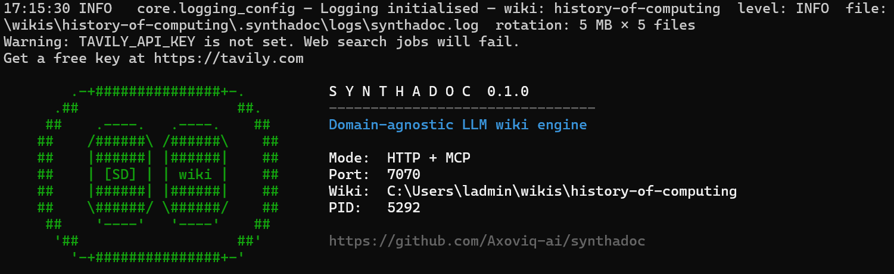

# Synthadoc Demo Guide — History of Computing

---

## Part 1 — Setup

### What is Obsidian?

Obsidian is a free, local-first knowledge management app. Everything is stored as
plain Markdown files on your machine — no cloud account required, no vendor lock-in.
You open a folder on your filesystem as a "vault" and Obsidian gives it a structured UI.

**Key features relevant to Synthadoc:**

| Feature | What it does |
|---------|--------------|
| **Graph view** | Visualises every `[[wikilink]]` between notes as a live node graph. Orphan pages (no inbound links) appear as isolated dots. |
| **Properties panel** | Renders YAML frontmatter (`status`, `confidence`, `tags`, `created`) as a structured sidebar. |
| **Dataview plugin** | Queries frontmatter across all notes in real time — like a SQL table over your markdown files. Powers the Synthadoc dashboard. |
| **Command palette** | `Ctrl/Cmd+P` runs any plugin command, including Synthadoc's ingest and query. |
| **Community plugins** | Extend Obsidian with third-party functionality installed from within the app. |

Obsidian is free for personal use. Download it from **obsidian.md**.

---

### What does Synthadoc add?

Obsidian is a writing and organisation tool — you create and edit notes manually.
synthadoc is a **compilation engine**: it reads raw source documents (PDFs, spreadsheets,
images, web pages) and uses an LLM to synthesise, cross-reference, and maintain a
structured wiki automatically.

| Without Synthadoc | With Synthadoc |
|-------------------|----------------|
| You write each note by hand | LLM synthesises notes from source documents |
| You manage links between notes | Cross-references are inserted automatically |
| You notice contradictions manually | Ingest pipeline flags conflicting content (`status: contradicted`) |
| You track orphan pages by eye | Dashboard and CLI report orphans with fix suggestions |
| Notes are static once written | Wiki compiles incrementally as new sources arrive |

synthadoc writes into the same Markdown files Obsidian reads. No special format — every
synthadoc wiki page is a valid Obsidian note.

---

### Supported source types & skills

Synthadoc routes every source to the right **skill** — a self-contained folder that knows
how to read one kind of content. Skills are selected by **file extension** or by
**intent phrase** in the source string. No `--skill` flag needed; the engine detects it
automatically.

| Skill | Triggered by | Notes |
|-------|-------------|-------|
| `pdf` | `.pdf` extension · phrases: `pdf`, `research paper`, `document` | Primary: pypdf. CJK fallback: pdfminer.six |
| `url` | `https://` / `http://` prefix · phrases: `fetch url`, `web page`, `website` | httpx + BeautifulSoup HTML cleaning |
| `markdown` | `.md` / `.txt` extension · phrases: `markdown`, `text file`, `notes` | Direct read, no transformation |
| `docx` | `.docx` extension · phrases: `word document`, `docx` | python-docx paragraph extraction |
| `pptx` | `.pptx` extension · phrases: `powerpoint`, `presentation`, `pptx` | python-pptx; each slide as a titled section; speaker notes included |
| `xlsx` | `.xlsx` / `.csv` extension · phrases: `spreadsheet`, `excel`, `csv` | openpyxl + stdlib csv |
| `image` | `.png` `.jpg` `.jpeg` `.webp` `.gif` `.tiff` · phrases: `image`, `screenshot`, `diagram`, `photo` | Base64 → vision LLM |
| `web_search` | Intent phrases only: `search for`, `find on the web`, `look up`, `web search`, `browse` | No file extension — purely intent-driven. Calls Tavily API; fans out top result URLs as individual ingest jobs. Requires `TAVILY_API_KEY`. |

**Custom skills:** drop a folder containing `SKILL.md` + `scripts/main.py` into
`<wiki-root>/skills/` and the engine picks it up on next start — no install or restart
required. A `SKILL.md` carries YAML frontmatter (name, triggers, entry point, dependencies)
plus a human-readable Markdown body for documentation.

---

### Set up the demo vault

This section walks you from a fresh install of synthadoc to a fully configured Obsidian
vault in one sequence. **Obsidian must already be installed** (download from obsidian.md).

**Step 1 — Install the demo wiki**

**Windows (cmd.exe):**
```cmd
synthadoc install history-of-computing --target %USERPROFILE%\wikis --demo
```

**Linux / macOS:**
```bash
synthadoc install history-of-computing --target ~/wikis --demo
```

Expected output:
```
Wiki 'history-of-computing' installed at ...
Open .../history-of-computing/ as an Obsidian vault — pages are in .../history-of-computing/wiki/
```

---

**Step 2 — Open the vault in Obsidian**

Open Obsidian → **Open folder as vault** → select the installed folder
(e.g. `%USERPROFILE%\wikis\history-of-computing`).

> **Tip — show all file types in the explorer:** By default Obsidian only displays
> file types it natively understands. `.xlsx` and `.pptx` files in `raw_sources/`
> will be hidden. To show them: **Settings → Files and links → Show all file types**
> → toggle **on**. The files are always present on disk and synthadoc
> reads them regardless of this setting — this is purely a display preference.

---

**Step 3 — Install the Dataview community plugin**

Dataview is required for the live dashboard in `wiki/dashboard.md`.

1. **Settings** (gear icon, bottom-left) → **Community plugins** → **Turn on community plugins**
2. Click **Browse** → search `Dataview` → **Install** → **Enable**

---

**Step 4 — Install the Synthadoc Obsidian plugin**

The plugin is pre-built (`obsidian-plugin/main.js`) — no build step needed unless you
modify the TypeScript source.

First, change into the `obsidian-plugin/` folder inside your cloned synthadoc repository, then run:

**Windows (cmd.exe):**
```cmd
mkdir "%USERPROFILE%\wikis\history-of-computing\.obsidian\plugins\synthadoc"
copy main.js "%USERPROFILE%\wikis\history-of-computing\.obsidian\plugins\synthadoc\"
copy manifest.json "%USERPROFILE%\wikis\history-of-computing\.obsidian\plugins\synthadoc\"
```

**Linux / macOS:**
```bash
vault=~/wikis/history-of-computing
mkdir -p "$vault/.obsidian/plugins/synthadoc"
cp main.js manifest.json "$vault/.obsidian/plugins/synthadoc/"
```

---

**Step 5 — Restart Obsidian, then enable and configure the plugin**

After copying the files, **fully quit and reopen Obsidian** — the plugin will not appear
until Obsidian is restarted.

1. In Obsidian: **Settings** → **Community plugins** → find **Synthadoc** → toggle **on**
2. Click the gear icon next to the Synthadoc entry
3. Set **Server URL** to `http://127.0.0.1:7070` (change only if you configured a different port)
4. Leave **Raw sources folder** as `raw_sources`
5. Close settings

---

### Set your API key

Synthadoc supports five LLM providers. The demo uses Anthropic by default, but **Gemini Flash is a great free-tier alternative** — 15 requests per minute and 1 million tokens per day at no cost, which is more than enough for demos and personal wikis.

#### Option A — Anthropic (Claude)

Get a key at console.anthropic.com — pay-per-token, no free tier.

**Windows (cmd.exe):**
```cmd
set ANTHROPIC_API_KEY=sk-ant-your-key-here
```
**Windows (PowerShell, permanent):**
```powershell
[System.Environment]::SetEnvironmentVariable("ANTHROPIC_API_KEY", "sk-ant-your-key-here", "User")
```
**Linux / macOS:**
```bash
export ANTHROPIC_API_KEY="sk-ant-your-key-here"
```

#### Option B — Google Gemini (free tier)

1. Go to **aistudio.google.com/app/apikey** → create a key (free, no credit card)
2. Set the key:

**Windows (cmd.exe):**
```cmd
set GEMINI_API_KEY=your-gemini-key-here
```
**Linux / macOS:**
```bash
export GEMINI_API_KEY="your-gemini-key-here"
```

3. Update the wiki config to use Gemini:

Open `<wiki-root>/.synthadoc/config.toml` (create it if absent) and add:

```toml
[agents]
default = { provider = "gemini", model = "gemini-2.0-flash" }
```

If `synthadoc serve` is already running, restart it after changing the config.

#### Switching providers mid-demo

You can switch at any time by changing the `provider` line in `.synthadoc/config.toml` and restarting the server. The wiki, cache, and audit trail are provider-agnostic — switching providers does not require re-ingesting anything.

| Provider | Key env var | Free tier |
|----------|-------------|-----------|
| `anthropic` | `ANTHROPIC_API_KEY` | No |
| `openai` | `OPENAI_API_KEY` | No |
| `gemini` | `GEMINI_API_KEY` | Yes (15 RPM, 1M tok/day) |
| `groq` | `GROQ_API_KEY` | Yes (Llama/Mixtral models) |
| `ollama` | _(none)_ | Yes (fully local) |

#### Tavily (web search — optional)

Web search ingestion (Step 10) requires a Tavily API key. Get a free key at
**tavily.com** (1,000 searches/month, no credit card required).

**Windows (cmd.exe):**
```cmd
set TAVILY_API_KEY=tvly-your-key-here
```
**Linux / macOS:**
```bash
export TAVILY_API_KEY="tvly-your-key-here"
```

If this key is not set, the server starts normally but web search jobs will fail.
Skip this step if you do not plan to use Step 10.

---

## Part 2 — Demo Walkthrough

> **Before starting:** complete Part 1 — Set up the demo vault. The vault should be
> open in Obsidian with Dataview and the Synthadoc plugin enabled.

### Vault orientation

- Wiki pages are in the `wiki/` subfolder
- `AGENTS.md` and `log.md` are at the vault root — outside `wiki/` so they do not
  appear as nodes in Graph view
- Open `wiki/dashboard.md` to see the live Dataview tables (requires the Dataview plugin)

In **Graph view** (`Ctrl/Cmd+G`) you should see 10 interconnected nodes. The `index` and
`dashboard` nodes connect to everything; topic pages cluster by cross-links.

---

### Step 1 — Start the server

The server must be running before any ingest, query, or lint command can execute.
Open a dedicated terminal and leave it running throughout the demo:

```
synthadoc serve -w history-of-computing
```

Expected output:
```
HTTP API running on http://127.0.0.1:7070
```



The banner confirms the mode (`HTTP + MCP`), port, wiki path, and PID. If you see
`Warning: TAVILY_API_KEY is not set`, web search jobs will not work — set the key
before Step 10 if you plan to use that feature.

Use a **second terminal** for all commands below. All plugin commands are now active.

> **Ribbon icon:** The Synthadoc book icon is in the narrow vertical strip on the far left
> edge of the window. It may be near the bottom if other plugins have added icons above it —
> hover over the icons to find the one with the **"Synthadoc status"** tooltip. Clicking it
> shows the live page count. The ribbon icon is optional; all core functionality is in the
> command palette (`Ctrl/Cmd+P`).

**Plugin commands available from this point on** (`Ctrl/Cmd+P` in Obsidian):

| Command | What it does |
|---|---|
| `Synthadoc: Ingest current file as source` | Queues the open file for ingest |
| `Synthadoc: Ingest all sources` | Queues every file under `raw_sources/` |
| `Synthadoc: Ingest from URL...` | Opens a URL input modal; queues a web page for ingest |
| `Synthadoc: Web search...` | Opens a search modal; type a topic and the engine fetches web results and ingests them *(v2)* |
| `Synthadoc: Query wiki...` | Opens a query modal with markdown-rendered answer and citations |
| `Synthadoc: Lint report` | Opens a modal showing contradicted pages and orphans |
| `Synthadoc: Run lint` | Queues a lint job; shows a notice with contradiction + orphan counts |
| `Synthadoc: Run lint with auto-resolve` | Same but LLM resolves contradictions automatically when confidence ≥ threshold |
| `Synthadoc: List jobs...` | Opens a filterable jobs table with per-job result details |

---

### Step 2 — Query the pre-built wiki

Before ingesting anything, verify the pre-built content is queryable:

```
synthadoc query "How did Alan Turing influence modern computers?" -w history-of-computing
synthadoc query "What is Moore's Law and why does it matter?" -w history-of-computing
synthadoc query "How did Unix influence the open source movement?" -w history-of-computing
```

Each answer cites `[[wikilinks]]` pointing to the source pages.

You can also query from Obsidian: open the command palette (`Ctrl/Cmd+P`) →
`Synthadoc: Query wiki...` → type your question → press **Ask**.

---

### Step 3 — Batch ingest all demo sources

The five source files are pre-built in `raw_sources/`:

| File | Skill | Scenario |
|------|-------|----------|
| `turing-enigma-decryption.pdf` | `pdf` (`.pdf` extension) | **A — Clean merge**: enriches `alan-turing` |
| `computing-pioneers-timeline.xlsx` | `xlsx` (`.xlsx` extension) | **A — Clean merge**: structured timeline, enriches multiple pages |
| `cs-milestones-overview.pptx` | `pptx` (`.pptx` extension) | **A — Clean merge + new pages**: 6-slide deck; enriches `ada-lovelace`, `alan-turing`, `grace-hopper`; creates new pages for ENIAC, transistor history, and internet origins |
| `first-compiler-controversy.pdf` | `pdf` (`.pdf` extension) | **B — Conflict**: contradicts `grace-hopper` |
| `quantum-computing-primer.png` | `image` (`.png` extension) | **C — Orphan**: brand new topic, no existing page links to it |

**Via CLI** using `--batch`:

```
synthadoc ingest --batch raw_sources/ -w history-of-computing
```

**Via Obsidian plugin**: command palette (`Ctrl/Cmd+P`) → `Synthadoc: Ingest all sources`.

Both methods enqueue one job per file. Watch all jobs at once:

```
synthadoc jobs list -w history-of-computing
```

Wait until all five show `completed`. Filter by status:

```
synthadoc jobs list --status pending -w history-of-computing
synthadoc jobs list --status completed -w history-of-computing
```

Or from Obsidian: command palette → `Synthadoc: List jobs...` → use the filter dropdown.

---

### Step 4 — Scenario A: Clean merge

Refresh Obsidian after the first three jobs complete.

**`turing-enigma-decryption.pdf`** — open `wiki/alan-turing.md`. New content about
Bletchley Park, the Bombe machine, and Turing's posthumous recognition has been merged
into the existing page without contradiction.

**`computing-pioneers-timeline.xlsx`** — the structured two-sheet workbook (timeline +
people reference) enriches several pages with new content appended to existing pages.

**`cs-milestones-overview.pptx`** — the 6-slide PowerPoint deck is processed slide by
slide. Each slide becomes a titled section in the extracted text. Open the ingest log to
see how the engine mapped slide content to wiki pages:

```
synthadoc audit history -w history-of-computing
```

Expected pages touched or created:

| Wiki page | What changed |
|-----------|-------------|
| `ada-lovelace.md` | Enriched with the 1843 Bernoulli-number algorithm detail from Slide 2 |
| `alan-turing.md` | ENIAC context from Slide 3 merged alongside existing Turing content |
| `grace-hopper.md` | The ENIAC Six detail from Slide 3 merged in |
| `eniac.md` _(new)_ | Created from Slide 3 — ENIAC weight, speed, and the six programmers |
| `transistor-and-moores-law.md` _(new)_ | Created from Slide 4 — Bell Labs, Shockley, Moore's Law |
| `internet-history.md` _(new)_ | Created from Slide 5 — ARPANET, TCP/IP Flag Day |

The speaker notes on each slide are extracted and included in the synthesis context,
giving the LLM extra background without cluttering the final wiki page.

You can also ingest the deck in one shot via CLI:

```
synthadoc ingest raw_sources/cs-milestones-overview.pptx -w history-of-computing
```

Verify with queries that use the new content:

```
synthadoc query "What was the Bombe machine and who built it?" -w history-of-computing
synthadoc query "Who invented FORTRAN and when?" -w history-of-computing
synthadoc query "Who were the ENIAC Six?" -w history-of-computing
synthadoc query "When did the modern internet begin?" -w history-of-computing
```

---

### Step 5 — Scenario B: Conflict detection and resolution

After `first-compiler-controversy.pdf` is processed, open `wiki/grace-hopper.md`.
The frontmatter will show:

```yaml
status: contradicted
```

The PDF argues Hopper's A-0 was a loader, not a compiler, and that FORTRAN (1957)
deserves the "first compiler" title — contradicting the existing page.

**Check via CLI:**
```
synthadoc lint report -w history-of-computing
```

```
Contradicted pages (1) - need review:

  grace-hopper
    -> Open wiki/grace-hopper.md, resolve the conflict, then set status: active
    -> Or re-run: synthadoc lint run -w history-of-computing --auto-resolve
```

**In Obsidian:** open `wiki/dashboard.md` — `grace-hopper` appears in the
**Contradicted pages** table. The Properties panel shows `status: contradicted`.

**Option 1 — Manual resolution:**

1. Open `wiki/grace-hopper.md` in Obsidian
2. Edit the content to reflect a nuanced view — Hopper pioneered automated code
   generation with A-0; Backus and IBM delivered the first production compiler with
   FORTRAN in 1957
3. Change `status: contradicted` → `status: active` in the Properties panel or frontmatter
4. Save — the Contradicted pages table in `dashboard.md` clears immediately

**Option 2 — LLM auto-resolve:**

```
synthadoc lint run -w history-of-computing --auto-resolve
synthadoc jobs status <job-id> -w history-of-computing
```

The LLM proposes a resolution, appends it as a `**Resolution:**` block, and sets
`status: active`. Review the result in Obsidian and edit if needed.

> **Option 3 — Via Claude (MCP):** see Step 11 for MCP setup and a full example.

---

### Step 6 — Scenario C: Orphan detection and human decision

After `quantum-computing-primer.png` is processed, a new wiki page is created (e.g.
`wiki/quantum-computing.md`). No existing page links to it — it is an orphan.

**Check via CLI:**
```
synthadoc lint report -w history-of-computing
```

```
Orphan pages (1) - no inbound links:

  quantum-computing
    -> Add [[quantum-computing]] to a related page, or add to wiki/index.md:
         - [[quantum-computing]] — quantum-computing, hardware, algorithms
```

**In Obsidian:** open `wiki/dashboard.md` — the new page appears in the **Orphan pages**
table. In Graph view it shows as an isolated node.

**Three options:**

**Option 1 — Link it (recommended):**
Open `wiki/artificial-intelligence-history.md` and add a sentence such as:
```
Quantum hardware such as [[quantum-computing]] may dramatically accelerate future AI workloads.
```
Save. The page is no longer an orphan and disappears from the dashboard table.

**Option 2 — Add to index:**
The lint report prints a ready-to-paste suggested entry — copy it, open `wiki/index.md`,
add a section heading if needed, and paste. Edit the description to your liking:
```markdown
## Platforms and AI
- [[quantum-computing]] — quantum-computing, hardware, algorithms
```

**Option 3 — Delete and re-ingest:**
If the extracted content quality is poor, delete `wiki/quantum-computing.md` from Obsidian
and re-ingest with a better source document later:
```
synthadoc ingest raw_sources/quantum-computing-primer.png --force -w history-of-computing
```

---

### Step 7 — Run a full lint pass

After resolving the conflict and orphan, confirm everything is clean:

```
synthadoc lint run -w history-of-computing
synthadoc jobs status <job-id> -w history-of-computing
synthadoc lint report -w history-of-computing
```

Expected output when all issues are resolved:
```
All clear — no contradictions or orphan pages found.
```

---

### Step 8 — Check overall status

```
synthadoc status -w history-of-computing
synthadoc jobs list -w history-of-computing
```

After the full demo the page count should be 12 or more (10 pre-built + newly ingested
pages). `synthadoc status` shows page count, pending jobs, and total jobs.

---

### Step 9 — Single-file ingest

The demo used batch ingest. You can also ingest one file at a time:

**Windows (PowerShell):**
```powershell
@'
# Ada Lovelace
Ada Lovelace (1815-1852) is widely regarded as the first computer programmer.
She worked with Charles Babbage on his Analytical Engine and wrote the first
algorithm intended to be processed by a machine.
'@ | Set-Content "$env:USERPROFILE\wikis\history-of-computing\raw_sources\ada-lovelace.txt"

synthadoc ingest raw_sources/ada-lovelace.txt -w history-of-computing
```

**Linux / macOS:**
```bash
cat > ~/wikis/history-of-computing/raw_sources/ada-lovelace.txt << 'EOF'
# Ada Lovelace
Ada Lovelace (1815-1852) is widely regarded as the first computer programmer.
She worked with Charles Babbage on his Analytical Engine and wrote the first
algorithm intended to be processed by a machine.
EOF

synthadoc ingest raw_sources/ada-lovelace.txt -w history-of-computing
```

The new page is created as an orphan — check `wiki/dashboard.md` or run
`synthadoc lint report -w history-of-computing` to see it, then link or index it.

You can also ingest from Obsidian: open any note → command palette (`Ctrl/Cmd+P`) →
`Synthadoc: Ingest current file as source`.

---

### Step 10 — Web search ingestion

> **Requires:** `TAVILY_API_KEY` — get a free key (1,000 searches/month) at **tavily.com**.
> Set it before starting the server: `set TAVILY_API_KEY=tvly-your-key-here` (Windows)
> or `export TAVILY_API_KEY="tvly-your-key-here"` (Linux/macOS).

The `web_search` skill is fully live in v0.1. Unlike every other skill, it has **no file extension** — it is selected by recognising an intent phrase in the source string. The engine calls the Tavily search API, gets the top result URLs (up to 20), and enqueues each URL as a separate ingest job. Pages are created for each result that passes scope filtering.

**Trigger phrases** (any of these in the source string activates the skill):

| Phrase | Example source string |
|--------|-----------------------|
| `search for` | `"search for: Dennis Ritchie C language Bell Labs"` |
| `find on the web` | `"find on the web: Linus Torvalds Linux creation story"` |
| `look up` | `"look up Ada Lovelace Analytical Engine contributions"` |
| `web search` | `"web search ENIAC first electronic computer 1945"` |
| `browse` | `"browse recent articles on quantum error correction"` |

**Example — enrich the history-of-computing wiki via web search:**

```
synthadoc ingest "search for: Dennis Ritchie C programming language Bell Labs history" -w history-of-computing
synthadoc ingest "find on the web: Linus Torvalds Linux kernel creation 1991" -w history-of-computing
synthadoc ingest "search for: ENIAC first general purpose electronic computer history" -w history-of-computing
```

Each command fans out to up to 20 URL ingest jobs. Watch them process:

```
synthadoc jobs list -w history-of-computing
```

Pages such as `dennis-ritchie`, `linux-kernel-history`, and `eniac` will be created or enriched. The `wiki/overview.md` page is regenerated automatically after each batch completes.

**Batch web search using a manifest file:**

Create `raw_sources/web-searches.txt`:

```
search for: Dennis Ritchie C programming language Bell Labs history
find on the web: Linus Torvalds Linux kernel creation 1991
search for: Ada Lovelace first computer programmer analytical engine
look up: history of ARPANET and internet origins
search for: John von Neumann stored-program computer architecture
```

Then ingest the whole file at once:

```
synthadoc ingest --file raw_sources/web-searches.txt -w history-of-computing
```

**Preview before committing** — use `--analyse-only` to see how a source will be interpreted without writing pages:

```
synthadoc ingest "search for: quantum computing IBM Google" --analyse-only -w history-of-computing
# → {"entities": ["IBM", "Google", "quantum computing"], "tags": [...], "summary": "..."}
```

**Via Obsidian plugin — dedicated web search modal:**

1. Open the command palette (`Ctrl+P` / `Cmd+P`)
2. Run **Synthadoc: Web search...**
3. Type a topic — e.g. `Linus Torvalds Linux kernel creation 1991`
4. Press **Enter** or click **Search**
5. You'll see: `Queued — job abc123. Pages will appear in your wiki as results are ingested.`
6. Switch to the **Synthadoc: List jobs...** modal to watch the fan-out jobs complete

The modal prepends `search for:` automatically — just type the topic, no prefix needed.

---

### Step 11 — Audit commands

The `synthadoc audit` commands query the append-only `audit.db` without needing `sqlite3`. Use them to review what was ingested, how much it cost, and what events occurred.

**Ingest history** — last 20 source records:

```
synthadoc audit history -w history-of-computing
```

Expected output:
```
Source                                    Pages created  Pages updated  Tokens   Cost
----------------------------------------  -------------  -------------  -------  ------
raw_sources/turing-enigma-decryption.pdf  alan-turing                   4820     $0.031
raw_sources/computing-pioneers-timeline…  ibm-history    alan-turing    6210     $0.040
raw_sources/first-compiler-controversy…               grace-hopper     3950     $0.025
raw_sources/quantum-computing-primer.p…  quantum-computing              5100     $0.033
```

**Cost summary** — token spend for the last 30 days:

```
synthadoc audit cost -w history-of-computing
```

Expected output:
```
Period: last 30 days
Total tokens : 20,080
Total cost   : $0.129
Sources processed: 4
Avg cost/source  : $0.032
```

Pass `--days 7` for a weekly view.

**Audit events** — contradiction detections, auto-resolutions, cost gate triggers:

```
synthadoc audit events -w history-of-computing
```

Expected output:
```
2026-04-11 14:35  contradiction_found   grace-hopper ← first-compiler-controversy.pdf
2026-04-11 14:37  auto_resolved         grace-hopper (confidence: 0.91)
```

These three commands replace the need to run raw `sqlite3` queries and are safe to run while the server is active.

---

### Step 12 — Control Synthadoc from Claude (MCP)

Synthadoc exposes an MCP server so Claude Desktop (or any MCP-capable Claude surface) can drive
the wiki in natural language — no CLI required.

#### Set up

**1. Start the server in MCP mode** (same process, adds MCP transport):

```
synthadoc serve -w history-of-computing
```

The standard `serve` command runs both the HTTP API (for the Obsidian plugin) and the MCP server
simultaneously. Leave this terminal running.

**2. Register in Claude Desktop config**

Locate your config file:

| Platform | Path |
|----------|------|
| Windows (Store app) | `%LOCALAPPDATA%\Packages\Claude_pzs8sxrjxfjjc\LocalCache\Roaming\Claude\claude_desktop_config.json` |
| Windows (direct install) | `%APPDATA%\Claude\claude_desktop_config.json` |
| macOS | `~/Library/Application Support/Claude/claude_desktop_config.json` |

Add the following entry, replacing the wiki path with the **absolute path** to your wiki root:

```json
{
  "mcpServers": {
    "synthadoc-history": {
      "command": "synthadoc",
      "args": ["serve", "--wiki", "C:\\Users\\you\\wikis\\history-of-computing", "--mcp-only"]
    }
  }
}
```

> **Important:** Use an absolute path for `--wiki`. Relative paths will not resolve because
> Claude Desktop has no working directory context.

> **Windows PATH note:** Claude Desktop may not inherit your user PATH. If the server fails
> to start, add the Python Scripts folder (e.g.
> `C:\Users\you\AppData\Roaming\Python\Python3xx\Scripts`) to your **system** PATH
> (not user PATH), then restart Claude Desktop fully from the system tray.

`--mcp-only` starts just the MCP transport without the HTTP API — use this when you only need
Claude access and not the Obsidian plugin. Omit it (use plain `serve`) when running both.

**3. Restart Claude Desktop**

Fully quit from the system tray (right-click → Quit) and relaunch. Open
Settings → Local MCP servers — `synthadoc-history` should show a green **running** badge.
You should see six tools: `synthadoc_ingest`, `synthadoc_query`, `synthadoc_lint`,
`synthadoc_search`, `synthadoc_status`, `synthadoc_job_status`.

---

#### Use case A — Resolve the grace-hopper contradiction

After Step 5, `wiki/grace-hopper.md` has `status: contradicted`. Instead of editing it manually,
ask Claude:

> *"Open my history-of-computing wiki and resolve the contradiction on the grace-hopper page."*

Claude will:
1. Call `synthadoc_lint(scope="contradictions")` to surface the conflict
2. Call `synthadoc_query("What does the first-compiler-controversy PDF argue about Grace Hopper?")` to
   understand both sides
3. Propose a nuanced resolution (Hopper pioneered automated code generation with A-0;
   FORTRAN 1957 was the first production compiler)
4. Apply it via `synthadoc_ingest` or direct file edit + status change

Review the result in Obsidian — the Properties panel should show `status: active`.

---

#### Use case B — Ingest a web page

Tell Claude:

> *"Ingest this Wikipedia article into my history-of-computing wiki: https://en.wikipedia.org/wiki/ENIAC"*

Claude calls `synthadoc_ingest(source="https://en.wikipedia.org/wiki/ENIAC")`, then polls
`synthadoc_job_status(job_id)` until the job completes. The new `eniac` page appears in
Obsidian automatically.

---

#### Use case C — Find gaps in your wiki coverage

Ask Claude:

> *"What topics are missing or underdeveloped in my history-of-computing wiki?"*

Claude calls `synthadoc_status()` for page count, then `synthadoc_search(terms=["coverage", "missing"])`,
reads `wiki/index.md`, and cross-references what is linked vs. what is referenced in the sources.

---

#### Use case D — Locate and fix orphan pages

After Step 6, `quantum-computing` is an orphan. Tell Claude:

> *"Check my history-of-computing wiki for orphan pages and suggest where to link them."*

Claude calls `synthadoc_lint(scope="orphans")`, reads the orphan list, reads related pages
(e.g. `artificial-intelligence-history.md`), and proposes a sentence to add — or edits it directly
if the Obsidian Claude plugin is active.

---

#### Use case E — Expand the wiki via web search

After reviewing the wiki, tell Claude:

> *"My history-of-computing wiki doesn't cover Dennis Ritchie or the C language. Search the web
> and add pages for both."*

Claude will:
1. Call `synthadoc_ingest(source="search for: Dennis Ritchie C programming language Bell Labs history")` — intent phrase routes to `web_search`
2. Call `synthadoc_ingest(source="search for: history of C programming language UNIX influence")` for supplementary context
3. Poll `synthadoc_job_status(job_id)` for each job
4. Call `synthadoc_query("What is the relationship between C, Unix, and Bell Labs?")` to verify the new pages are queryable
5. Report the new pages created and suggest `[[wikilinks]]` to add in related pages such as `unix-history` and `programming-languages-overview`

You can also drive multi-topic research in one prompt:

> *"Search the web for the top 5 computing pioneers not yet in my wiki and add a page for each."*

Claude reads `wiki/index.md` to find what is already covered, builds a list of gaps, then
fires one `synthadoc_ingest` per topic using `search for:` intent strings, and links each
new page back into `index.md`.

---

### Step 13 — Hook: auto-commit wiki to git

Hooks let you trigger shell scripts on lifecycle events. This step wires up
`git-auto-commit.py` so every successful ingest produces a git commit
— giving the wiki automatic version history with descriptive commit messages.

#### One-time setup

**1. Initialise a git repo in the wiki root** (skip if already done):

```bash
cd $(synthadoc status | grep Path | awk '{print $2}')
git init
git add .
git commit -m "init: initial wiki snapshot"
```

**2. Copy the hook script from the library:**

```bash
cp /path/to/synthadoc/repo/hooks/git-auto-commit.py .
```

**3. Add to `.synthadoc/config.toml`:**

```toml
[hooks]
on_ingest_complete = "python git-auto-commit.py"
```

**4. Restart the server** to pick up the config change:

```bash
synthadoc serve -w history-of-computing
```

#### Run it

Ingest a new source:

```
synthadoc ingest sources/ada-lovelace.md -w history-of-computing
```

#### Verify

```bash
git log --oneline -5
```

Expected output:

```
a3f1b2c wiki: ingest ada-lovelace.md → created ada-lovelace
d9e4c81 wiki: ingest turing-award.pdf → updated alan-turing; created turing-award
...
```

Each commit message names the source file and lists which pages were created
or updated. Open the wiki in Obsidian — `git log` is the full audit trail of
how the wiki evolved over time.

> **More hooks:** see [`hooks/README.md`](../hooks/README.md) in the repository
> for the full library and contribution guidelines.

---

### Step 14 — Scheduler: nightly auto-ingest

Hooks react to events that already happened. The scheduler goes the other
direction — it proactively triggers operations on a timer, so the wiki
stays fresh without any manual intervention.

**Use case:** as you drop new PDFs, articles, or notes into `raw_sources/`
during the day, a nightly ingest job picks them all up automatically overnight.

#### Register a nightly ingest

```bash
synthadoc schedule add \
  --op "ingest --batch raw_sources/" \
  --cron "0 2 * * *" \
  -w history-of-computing
```

Expected output:
```
Scheduled: sched-a3f1b2c4
```

Synthadoc registers the job directly with the OS scheduler — `crontab` on
macOS/Linux, Task Scheduler (`schtasks`) on Windows. No background daemon
is needed; the OS owns the timer.

#### Verify it was registered

```bash
synthadoc schedule list -w history-of-computing
```

Expected output:
```
sched-a3f1b2c4  0 2 * * *  ingest --batch raw_sources/ -w history-of-computing
```

#### Add a weekly lint pass

```bash
synthadoc schedule add \
  --op "lint run" \
  --cron "0 3 * * 0" \
  -w history-of-computing
```

This registers a Sunday 3 am lint run — contradictions and orphans caught
every week automatically.

```bash
synthadoc schedule list -w history-of-computing
```

Expected output:
```
sched-a3f1b2c4  0 2 * * *  ingest --batch raw_sources/ -w history-of-computing
sched-b7e9d012  0 3 * * 0  lint run -w history-of-computing
```

#### Clean up (demo only)

Remove the scheduled jobs so they do not run after the demo:

```bash
synthadoc schedule remove sched-a3f1b2c4 -w history-of-computing
synthadoc schedule remove sched-b7e9d012 -w history-of-computing
```

> **Note:** the server must be running when a scheduled job fires. For
> production use, run `synthadoc serve` as a background service (systemd,
> launchd, or Windows Service) so it is always available when the OS
> triggers the schedule.

---

### Step 15 — Uninstall

```
synthadoc uninstall history-of-computing
```

Two confirmations required:
1. `y` to confirm deletion
2. Type `history-of-computing` to confirm the name

The directory and registry entry are both removed. There is no `--yes` flag — this is intentional.
