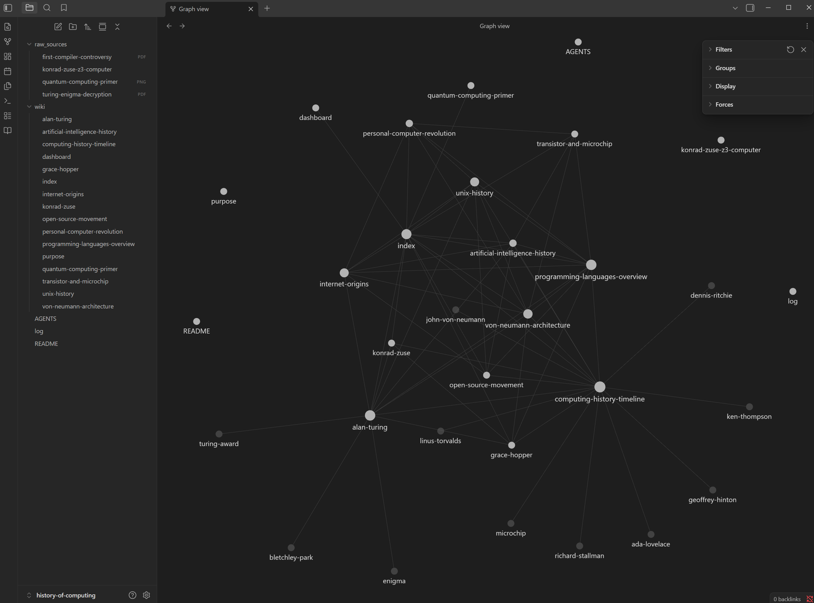
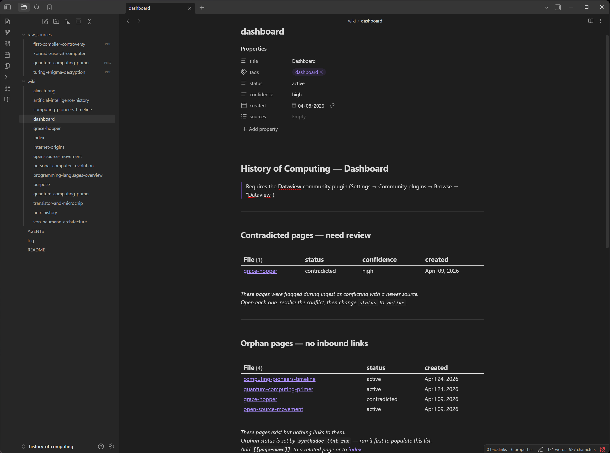

# Synthadoc User Quick-Start Guide

**Version: v0.3.0 (Community Edition)**

This guide walks you through the **History of Computing** demo wiki — a fully wired
Synthadoc environment with 10 pre-built pages and six raw source files that cover every
major engine feature. No setup beyond following the steps below is required.

> **Before you start:** complete [README Installation Steps 1–6](../README.md#installation)
> (clone, install, set your API key, install the demo wiki, and start the engine).
> Then come back here.

---

## Table of Contents

1. [Verify the demo server has started](#step-1--verify-the-demo-server-has-started)
2. [Install Dataview in Obsidian](#step-2--install-dataview-in-obsidian)
3. [Install the Synthadoc plugin and open the vault](#step-3--install-the-synthadoc-plugin-and-open-the-vault)
4. [Review the wiki structure and key files](#step-4--review-the-wiki-structure-and-key-files)
5. [Query the pre-built wiki (CLI + Obsidian)](#step-5--query-the-pre-built-wiki-cli--obsidian)
6. [Batch ingest all demo sources](#step-6--batch-ingest-all-demo-sources)
7. [Resolve a contradiction](#step-7--resolve-a-contradiction)
8. [Fix an orphan page](#step-8--fix-an-orphan-page)
9. [Web search ingestion](#step-9--web-search-ingestion)
10. [Ingest a YouTube video](#step-10--ingest-a-youtube-video)
11. [Enrich the wiki with scaffold](#step-11--enrich-the-wiki-with-scaffold)
12. [Audit features](#step-12--audit-features)
13. [Scheduling recurring operations](#step-13--scheduling-recurring-operations)

**Appendices**

- [Appendix A — Obsidian Plugin Command Reference](#appendix-a--obsidian-plugin-command-reference)
- [Appendix B — Hooks: auto-commit wiki to git](#appendix-b--hooks-auto-commit-wiki-to-git)
- [Appendix C — Switching LLM providers](#appendix-c--switching-llm-providers)
- [Appendix D — Tavily web search key](#appendix-d--tavily-web-search-key)
- [Appendix E — Configuration](#appendix-e--configuration)
- [Appendix G — Using a Coding Tool as Your LLM Provider](#appendix-g--using-a-coding-tool-as-your-llm-provider)

---

## Step 1 — Verify the demo server has started

If you ran `synthadoc serve -w history-of-computing` or
`synthadoc serve -w history-of-computing --background` in the README, the server
should already be listening on port 7070. Confirm it is up:

```bash
synthadoc status -w history-of-computing
```

Expected output:

```
Wiki:         /home/user/wikis/history-of-computing
Pages:        12
Jobs pending: 0
Jobs total:   0
```

Or probe the health endpoint directly:

```bash
curl http://127.0.0.1:7070/health
# → {"status":"ok"}
```

If neither responds, start the server now:

```bash
# Foreground (terminal stays attached — logs stream to console)
synthadoc serve -w history-of-computing

# Background (terminal is released — logs go to wiki log file)
synthadoc serve -w history-of-computing --background
```


The banner confirms the port, wiki path, active LLM provider/model, and PID. If you see
`Warning: TAVILY_API_KEY is not set`, web search (Step 9) will not work — see
[Appendix D — Tavily web search key](#appendix-d--tavily-web-search-key).

If the server does not start, the most common cause is the port already being in use.
Check `<wiki-root>/.synthadoc/config.toml` for `[server] port` and use `--port N` to
override if needed.

> To use Claude Code or Opencode as your LLM provider instead of a direct API key, see [Appendix G](#appendix-g--using-a-coding-tool-as-your-llm-provider).

### Set your active wiki (do this once)

```bash
synthadoc use history-of-computing
```

From this point on, every command in this guide omits `-w history-of-computing` — the active wiki is resolved automatically.

To see which wiki is active at any time:
```bash
synthadoc use
```

---

## Step 2 — Install Dataview in Obsidian

Obsidian is a free, local-first knowledge management app — all notes are plain Markdown
on your machine. Synthadoc writes its wiki pages in Obsidian-compatible format, so you
can browse and search the wiki without any tool running.

**Obsidian must already be installed** — download from **[obsidian.md](https://obsidian.md)** if not.

### Open the vault

In Obsidian: **Open folder as vault** → select the installed wiki folder:

- **Windows:** `%USERPROFILE%\wikis\history-of-computing`
- **Linux / macOS:** `~/wikis/history-of-computing`

> **Tip — show all file types in the explorer:** By default Obsidian hides file types it
> does not natively understand (`.xlsx`, `.pptx`, etc.). To show them: **Settings →
> Files and links → Show all file types → on**. The engine reads them regardless.

**Dataview** is an Obsidian community plugin that provides SQL-like live queries over
YAML frontmatter. The Synthadoc dashboard (`wiki/dashboard.md`) uses it to display
contradicted pages and orphans in real time.

**Install Dataview:**

1. Open Obsidian → **Settings** (gear icon, bottom-left) → **Community plugins**
2. Toggle **Turn on community plugins** if it is off
3. Click **Browse** → search `Dataview` → **Install** → **Enable**
4. Close settings

> **Dataview cache:** Dataview caches frontmatter and may not immediately reflect changes
> made by Synthadoc. If the dashboard disagrees with `synthadoc lint report`, drop the
> cache: `Ctrl/Cmd+P` → **Dataview: Drop all cached file metadata**, then reopen the
> dashboard. The CLI report reads files directly and is always authoritative.

---

## Step 3 — Install the Synthadoc plugin and open the vault

### Install the Synthadoc plugin

The plugin ships pre-built as `obsidian-plugin/main.js` — no build step required.

From the `obsidian-plugin/` folder inside your cloned Synthadoc repo:

**Linux / macOS:**

```bash
vault=~/wikis/history-of-computing
mkdir -p "$vault/.obsidian/plugins/synthadoc"
cp main.js manifest.json "$vault/.obsidian/plugins/synthadoc/"
```

**Windows (cmd.exe):**

```cmd
mkdir "%USERPROFILE%\wikis\history-of-computing\.obsidian\plugins\synthadoc"
copy main.js "%USERPROFILE%\wikis\history-of-computing\.obsidian\plugins\synthadoc\"
copy manifest.json "%USERPROFILE%\wikis\history-of-computing\.obsidian\plugins\synthadoc\"
```

### Enable and configure the plugin

**Fully quit and reopen Obsidian** — the plugin will not appear until Obsidian restarts.

1. **Settings → Community plugins** → find **Synthadoc** → toggle **on**
2. Click the gear icon next to the Synthadoc entry
3. Set **Server URL** to `http://127.0.0.1:7070`
   (change only if you configured a different port)
4. Leave **Raw sources folder** as `raw_sources`
5. Close settings

The **Synthadoc ribbon icon** (book icon on the far-left sidebar) confirms the plugin is
active. Clicking it shows the live page count and server health.


All Synthadoc commands are also reachable via the Command Palette (`Ctrl/Cmd+P` → type
`Synthadoc`). For the full command reference see
[Appendix A — Obsidian Plugin Command Reference](#appendix-a--obsidian-plugin-command-reference).


---

## Step 4 — Review the wiki structure and key files

Open the vault explorer. The key files and folders:

```
history-of-computing/
  wiki/                   ← compiled Markdown pages (open these in Obsidian)
    index.md              ← table of contents with [[wikilinks]] to every page
    dashboard.md          ← live Dataview tables — orphans, contradictions, recent pages
    purpose.md            ← scope definition — what belongs in this wiki and what to skip
    overview.md           ← LLM-generated 2-paragraph summary of the entire wiki
    alan-turing.md        ← example pre-built topic page
    grace-hopper.md       ← ...and so on for each of the 10 pre-built pages
  raw_sources/            ← source documents to ingest (PDF, PPTX, XLSX, PNG, MD)
  AGENTS.md               ← LLM instructions — domain guidelines for ingest and query
  log.md                  ← human-readable activity log of every ingest and lint event
  .synthadoc/
    config.toml           ← per-wiki settings (port, LLM provider, cost limits)
    audit.db              ← immutable audit trail (ingest history, costs, events)
    jobs.db               ← job queue (persistent across server restarts)
    cache.db              ← LLM response cache (reduces repeat spend)
```

**Open these files in Obsidian now:**


| File                  | What to look at                                                   |
| --------------------- | ----------------------------------------------------------------- |
| `wiki/index.md`       | Pre-generated category structure with`[[wikilinks]]` to each page |
| `wiki/dashboard.md`   | Live Dataview tables — will populate after Steps 6–8            |
| `wiki/alan-turing.md` | YAML frontmatter:`status`, `confidence`, `tags`, `sources[]`      |
| `AGENTS.md`           | Domain-specific guidelines the LLM reads on every ingest          |
| `wiki/purpose.md`     | In-scope / out-of-scope definition for History of Computing       |

**Graph view** (`Ctrl/Cmd+G`): the 10 pre-built pages should appear as interconnected
nodes. `index` and `dashboard` connect to everything; topic pages cluster by cross-links.


---

## Step 5 — Query the pre-built wiki (CLI + Obsidian)

### CLI queries

The wiki already has 13 pages on computing history — query them before ingesting anything:

```bash
synthadoc query "How did Alan Turing influence modern computers?"
synthadoc query "What is Moore's Law and why does it matter?"
synthadoc query "How did Unix influence the open-source movement?"
```

Each answer cites `[[wikilinks]]` pointing to the source pages.

### Compound and multi-part queries

Synthadoc automatically decomposes complex questions into focused sub-queries, retrieves
pages for each part in parallel, then synthesises a single merged answer:

```bash
# Two-part question — decomposes into two independent BM25 searches
synthadoc query "Compare Alan Turing's theoretical contributions with Von Neumann's architectural contributions."

# Multi-hop causal question — automatically decomposed
synthadoc query "How did Moore's Law shape both hardware design and software expectations over time?"
```

The server log shows the decomposition:

```
query decomposed into 2 sub-question(s):
  "Alan Turing theoretical contributions" | "Von Neumann architectural contributions"
```

Simple single-topic questions decompose to one sub-question and behave identically to
a direct query — no extra LLM cost.

> **Slow provider?** Reasoning models (e.g. MiniMax M2.x) can take longer to respond.
> If you see a timeout error, pass `--timeout 120`:
> ```bash
> synthadoc query "How did Moore's Law shape hardware design?" --timeout 120
> ```

### Knowledge gap detection

If the wiki does not cover a topic, Synthadoc detects the gap automatically:

```bash
synthadoc query "What is quantum error correction?"
```

Expected output (example):

```
No relevant pages found on this topic.

[!tip] Knowledge Gap Detected
Your wiki doesn't have enough on this topic yet. Enrich it with a web search:

  synthadoc ingest "search for: quantum error correction methods"
  synthadoc ingest "search for: quantum computing hardware qubits"
```

The suggested search strings are generated automatically. Run one of the suggestions
after Step 9 to fill the gap.


### Query from Obsidian

Open the Command Palette (`Ctrl/Cmd+P`) → `Synthadoc: Query: ask the wiki...` → type a
question → press `Ctrl/Cmd+Enter`. The answer appears in a responsive modal with
clickable `[[wikilinks]]`.


---

## Step 6 — Batch ingest all demo sources

The six source files in `raw_sources/` are designed to demonstrate every ingest scenario:


| File                               | Skill      | Scenario                                                                                                                                                                 |
| ---------------------------------- | ---------- | ------------------------------------------------------------------------------------------------------------------------------------------------------------------------ |
| `turing-enigma-decryption.pdf`     | `pdf`      | **A — Clean merge**: enriches `alan-turing` with Bletchley Park and Bombe detail                                                                                        |
| `computing-pioneers-timeline.xlsx` | `xlsx`     | **A — Clean merge**: structured two-sheet timeline; enriches multiple pages                                                                                             |
| `cs-milestones-overview.pptx`      | `pptx`     | **A — Clean merge + new pages**: 6-slide deck; creates `eniac`, `transistor-and-moores-law`, `internet-history`; enriches `ada-lovelace`, `alan-turing`, `grace-hopper` |
| `first-compiler-controversy.pdf`   | `pdf`      | **B — Conflict**: contradicts `grace-hopper` (A-0 vs FORTRAN dispute)                                                                                                   |
| `quantum-computing-primer.png`     | `image`    | **A — New page**: vision LLM extracts key concepts; creates `quantum-computing`                                                                                         |
| `konrad-zuse-z3-computer.md`       | `markdown` | **C — Orphan**: specific niche topic; creates `konrad-zuse` with no inbound links                                                                                       |

### Run batch ingest

**CLI:**

```bash
synthadoc ingest --batch raw_sources/
```

**Obsidian:** Command Palette → `Synthadoc: Ingest: all sources in folder`

Both enqueue one job per file. Watch them:

```bash
synthadoc jobs list
```


Wait until all six show `completed`. Filter by status if needed:

```bash
synthadoc jobs list --status pending
synthadoc jobs list --status completed
```

Or from Obsidian: Command Palette → `Synthadoc: Jobs: list...` → use the filter dropdown.

### Verify the results

Once all jobs complete, open **Graph view** (`Ctrl/Cmd+G`) — new nodes appear for the
ingested topics and link into the existing graph.



Run a few queries that use the new content:

```bash
synthadoc query "What was the Bombe machine and who built it?"
synthadoc query "Who invented FORTRAN and when?"
synthadoc query "What did Konrad Zuse contribute to computing history?"
```

---

## Step 7 — Resolve a contradiction

After `first-compiler-controversy.pdf` is processed, `wiki/grace-hopper.md` will have:

```yaml
status: contradicted
```

The PDF argues that Hopper's A-0 was a loader rather than a compiler, and that FORTRAN
(1957) was the first production compiler — contradicting the existing page.

**Check via CLI:**

```bash
synthadoc lint report
```

```
Contradicted pages (1) - need review:

  grace-hopper
    -> Open wiki/grace-hopper.md, resolve the conflict, then set status: active
    -> Or re-run: synthadoc lint run --auto-resolve
```

**In Obsidian:** open `wiki/dashboard.md` — `grace-hopper` appears in the
**Contradicted pages** Dataview table. The Properties panel shows `status: contradicted`.



### Option 1 — Manual resolution (recommended first time)

1. Open `wiki/grace-hopper.md` in Obsidian
2. Edit the body to reflect a nuanced view — Hopper pioneered automated code generation
   with A-0; Backus and IBM delivered the first production compiler with FORTRAN in 1957
3. Change `status: contradicted` → `status: active` in the Properties panel
4. Save — the Contradicted pages table clears immediately

### Option 2 — LLM auto-resolve

```bash
synthadoc lint run --auto-resolve
synthadoc jobs status <job-id>
```

The LLM proposes a resolution, appends it as a `**Resolution:**` block, and sets
`status: active`. Review the result in Obsidian and edit if needed.

Or from Obsidian: Command Palette → `Synthadoc: Lint: run with auto-resolve`.

> **Dashboard still showing the contradiction?** Dataview may be serving stale metadata.
> Drop the cache: `Ctrl/Cmd+P` → **Dataview: Drop all cached file metadata**, then reopen
> `dashboard.md`. If `synthadoc lint report` shows "all clear", the file is already
> correct — Dataview just has not caught up yet.

---

## Step 8 — Fix an orphan page

After `konrad-zuse-z3-computer.md` is processed, a new page `wiki/konrad-zuse.md` is
created. Because no existing page links to it, it is an **orphan** — a page with no
inbound `[[wikilinks]]`.

**Check via CLI:**

```bash
synthadoc lint report
```

```
Orphan pages (1) - no inbound links:

  konrad-zuse
    -> Add [[konrad-zuse]] to a related page, or add to wiki/index.md:
         - [[konrad-zuse]] — computer history, Germany, Z3, Plankalkül
```

**In Obsidian:** open `wiki/dashboard.md` — `konrad-zuse` appears in the **Orphan pages**
Dataview table.

> **Note on Graph view:** Obsidian's Graph view draws edges for both inbound and outbound
> links, so an orphan page that contains its own `[[wikilinks]]` to other pages may appear
> connected. Synthadoc defines an orphan as having **no inbound links** — always use
> `synthadoc lint report` as the authoritative check.

### Option 1 — Link it (recommended)

Open `wiki/programming-languages-overview.md` and add a reference:

```
Konrad Zuse independently developed [[konrad-zuse|Plankalkül]], the earliest known
design of a high-level programming language, in Germany during World War II.
```

Save — the orphan disappears from the dashboard immediately.

### Option 2 — Delete and re-ingest later

If the page content quality is poor, delete `wiki/konrad-zuse.md` from Obsidian and
re-ingest with a better source document:

```bash
synthadoc ingest raw_sources/konrad-zuse-z3-computer.md
```

---

## Step 9 — Web search ingestion

> **Requires `TAVILY_API_KEY`** — see [Appendix D](#appendix-d--tavily-web-search-key).
> Without it, web search jobs fail with `[ERR-SKILL-004]`. All other features work normally.

### What's new in v0.3.0

- **Coding tool CLI providers** — set `provider = "claude-code"` or `provider = "opencode"` in `config.toml` to run all agents using your existing Claude Code or Opencode subscription, with no separate API key required. See [Appendix G](#appendix-g--using-claude-code-or-opencode-as-llm-provider) for setup.
- **YouTube transcript ingest** — ingest any YouTube video (standard or Shorts) by URL. Captions are extracted automatically with no API key, and each page opens with an LLM-generated executive summary followed by a timestamped transcript.
- **Knowledge gap detection** — improved reliability across multi-aspect queries; CJK (Chinese, Japanese, Korean) queries no longer produce false gap reports.
- **Session wiki resolution** — `synthadoc use <name>` saves your active wiki so `-w` is optional on every subsequent command.
- **DeepSeek provider** — eighth LLM provider added; very low text-only rates.

### What's new in v0.2.0

Synthadoc now **decomposes web search topics** into multiple focused keyword sub-queries
before hitting Tavily. Each sub-query fires a separate parallel search, URLs are
deduplicated across all results, and each is enqueued as an individual ingest job.
This produces richer, more targeted pages than a single broad search.

```
Input: "search for: history of ARPANET and internet origins"

Server log:
  web search decomposed into 3 queries:
    "ARPANET creation 1969 DARPA" | "TCP/IP protocol development history" | "internet origins packet switching"

Result: 3 parallel Tavily searches → ~60 URLs ingested vs ~20 from a single search
```

Decomposition falls back gracefully — if the LLM call fails, the original phrase is used as
a single query and the ingest always completes.

### Run a web search ingest

```bash
synthadoc ingest "search for: Dennis Ritchie C programming language Bell Labs history"
synthadoc ingest "search for: ENIAC first general purpose electronic computer history"
```

Each command fans out to up to 20 URL ingest jobs. The commands return immediately —
all processing happens in the background. Watch progress with:

```bash
synthadoc jobs list
```

> **How long does it take?**
> - **Free-tier Gemini (15 RPM) or Groq:** Two searches produce ~20–40 LLM calls. The
>   server retries automatically when the rate limit is hit (you will see
>   `Rate limit (429) — waiting 60 s` in the server log — this is normal). Expect
>   **3–8 minutes** for both searches to fully complete.
> - **Paid tier (Gemini paid, MiniMax, Anthropic, OpenAI):** No rate-limit retries.
>   Both searches typically finish in **under 2 minutes**.

Pages such as `dennis-ritchie`, `eniac-history`, and related topics will be created or
enriched. The `wiki/overview.md` page is regenerated automatically after each batch
completes.

### Control the scope

Limit how many URLs are enqueued (default: 20):

```bash
synthadoc ingest "search for: quantum computing IBM Google" --max-results 5
```

**Batch via manifest file:** create `raw_sources/web-searches.txt`:

```
search for: Dennis Ritchie C programming language Bell Labs history
find on the web: Linus Torvalds Linux kernel creation 1991
search for: Ada Lovelace first programmer Analytical Engine Babbage
look up: history of ARPANET and internet origins
```

Then ingest all at once:

```bash
synthadoc ingest --file raw_sources/web-searches.txt
```

### Web search from Obsidian — live view

Open the Command Palette → `Synthadoc: Ingest: web search...`:

1. Type a topic — e.g. `Linus Torvalds Linux kernel creation 1991`
2. Set **Max results** (1–50, default 20) to control scope
3. Adjust **Poll interval** if desired (default: 2000 ms)
4. Press `Ctrl/Cmd+Enter` or click **Search**

The modal transitions to a live view:

- **Searching the web…** — while Tavily fetches
- **Found N URLs — ingesting…** — as fan-out jobs are created
- **Ingesting N URLs… (M done)** — counting completed child jobs
- A **Pages** list grows in real time as each URL ingest completes
- **Errors** (blocked domains, 404s) appear in red
- **Done — N page(s) written.** when all jobs settle


The modal prepends `search for:` automatically — just type the topic, no prefix needed.

---

## Step 10 — Ingest a YouTube video

Pass any YouTube URL directly — the transcript is extracted automatically from the
YouTube caption system (no API key, no audio download). Standard videos and **YouTube
Shorts** (`https://www.youtube.com/shorts/...`) are both supported:

```bash
synthadoc ingest "https://www.youtube.com/watch?v=O5nskjZ_GoI"
synthadoc ingest "https://youtu.be/O5nskjZ_GoI"              # short-link form
```

This ingests *Early Computing: Crash Course Computer Science #1*, which covers Hollerith,
Babbage, Lovelace, and the first programmable machines — a natural fit for the demo wiki.

The demo wiki also ships a `sources.txt` manifest at the project root (outside
`raw_sources/` — files in that folder are batch-ingested as documents, so a `.txt`
there would be treated as a text file rather than a URL list). The manifest mixes
source types to show what batch ingestion can handle in one pass:

```bash
synthadoc ingest --file sources.txt
```

The wiki page opens with an **executive summary** — a brief description of what the video
covers, the main topics as bullet points, and the key takeaway — so you can assess
relevance at a glance. The full timestamped transcript follows for precise cross-referencing.

> **Captions required** — the video must have captions (auto-generated or manually added).
> Check by opening the video on YouTube → `...` → **Show transcript**. If no transcript
> panel appears, the source is skipped with a warning and ingestion continues.

> **Short vs. long videos** — short videos produce a single wiki page. Long videos are
> chunked automatically by the existing `max_pages_per_ingest` limit.

Watch progress:

```bash
synthadoc jobs list
```

> **Tavily search + YouTube** — if Tavily returns YouTube URLs as web search results, they
> are automatically routed to the YouTube transcript skill. No extra steps needed.

---

## Step 11 — Enrich the wiki with scaffold

After batch ingest, the wiki has grown from 10 pre-built pages to 12 or more. **Scaffold**
reads the current wiki state and uses the LLM to regenerate the structure files —
`wiki/index.md`, `AGENTS.md`, and `wiki/purpose.md` — so they reflect what the wiki has
actually become. Existing pages that are already linked in `index.md` are detected as
**protected slugs** and preserved; only unlinked and new categories are refreshed.

### Run scaffold

```bash
synthadoc scaffold
```

Expected output:

```
Reading current wiki content…
Generating domain-specific scaffold (History of Computing)…
  Protected slugs: alan-turing, grace-hopper, von-neumann-architecture, unix-history, … (10 pages)
  Scaffold complete — domain-specific content generated.
wiki/index.md updated
AGENTS.md updated
wiki/purpose.md updated
```

Open `wiki/index.md` in Obsidian — it now has richer category headings that reflect the
full post-ingest wiki (e.g. **Pioneers and Visionaries**, **Hardware Milestones**,
**Software and Languages**, **European Computing**, **Emerging Technology**).

### Re-run scaffold at any time

As the wiki grows, re-running scaffold keeps the index structure current:

```bash
synthadoc scaffold
```

`config.toml` and `dashboard.md` are **never touched** by scaffold.

### Schedule scaffold automatically

To keep the index fresh without manual intervention:

```bash
# Weekly scaffold refresh — every Sunday at 4 AM
synthadoc schedule add --op "scaffold" --cron "0 4 * * 0"
```

---

## Step 12 — Audit features

The `synthadoc audit` commands query the append-only `audit.db` — no `sqlite3` required.

### Ingest history

```bash
synthadoc audit history
```

Shows the last 50 ingest records: timestamp, source file, wiki pages created/updated,
token count, and cost. Use `--limit N` (or `-n N`) for more records and `--json` for machine-readable output.


### Cost summary

```bash
synthadoc audit cost
```

Expected output:

```
Period: last 30 days
Total tokens : 22,400
Total cost   : $0.143
Sources processed: 6
Avg cost/source  : $0.024
```

Pass `--days 7` for a weekly view. Per-model cost tracking is fully live in v0.2.0.


### Query history

```bash
synthadoc audit queries
```

Shows recent questions asked, how many sub-questions each was decomposed into, token
usage, and per-query cost. Especially useful after running the compound queries in Step 5.

### Audit events

```bash
synthadoc audit events
```

Expected after Steps 6–8:

```
2026-04-21 10:12  contradiction_found   grace-hopper ← first-compiler-controversy.pdf
2026-04-21 10:14  auto_resolved         grace-hopper (confidence: 0.91)
```

Records every contradiction detection, auto-resolution, and cost gate trigger.

---

## Step 13 — Scheduling recurring operations

Hooks react to events that already happened. The scheduler goes the other direction —
it proactively triggers operations on a timer, keeping the wiki fresh automatically.

### Register a nightly batch ingest

```bash
synthadoc schedule add \
  --op "ingest --batch raw_sources/" \
  --cron "0 2 * * *" \
 
```

This registers a 2 AM daily ingest directly with the OS scheduler (`crontab` on
macOS/Linux, Task Scheduler on Windows). No background daemon required.

### Register a weekly lint pass + weekly scaffold refresh

```bash
synthadoc schedule add --op "lint run" --cron "0 3 * * 0"
synthadoc schedule add --op "scaffold" --cron "0 4 * * 0"
```

### Verify

```bash
synthadoc schedule list
```

Expected:

```
sched-a3f1b2c4  0 2 * * *  ingest --batch raw_sources/
sched-b7e9d012  0 3 * * 0  lint run
sched-c9f3e201  0 4 * * 0  scaffold
```

### Clean up (demo only)

Remove the scheduled jobs so they do not run after the demo:

```bash
synthadoc schedule remove sched-a3f1b2c4
synthadoc schedule remove sched-b7e9d012
synthadoc schedule remove sched-c9f3e201
```

> **Production use:** for always-on scheduling, run `synthadoc serve` as a background
> service (systemd, launchd, or Windows Service) so the server is available when the OS
> fires the scheduled task.

---

## What's next?

You have now walked through every major Synthadoc feature on the demo wiki. When you're
ready to build a wiki for your own domain:

- **[README — Creating Your Own Wiki](../README.md#creating-your-own-wiki)** — two commands and you're running

Key differences from the demo:

- `synthadoc install <name> --target <dir> --domain "<your domain>"` generates LLM
  scaffold for your domain at install time (index categories, AGENTS.md, purpose.md)
- Drop your own source files into `raw_sources/` and run batch ingest
- Use web search to fill knowledge gaps as your wiki grows
- Schedule nightly ingests and weekly scaffold refresh to keep it current automatically

---

## Appendix A — Obsidian Plugin Command Reference

All commands are accessible via the Command Palette (`Ctrl/Cmd+P` → type `Synthadoc`).

### Ingest


| Command                                    | What it does                                                                                                                                                                                                                              |
| ------------------------------------------ | ----------------------------------------------------------------------------------------------------------------------------------------------------------------------------------------------------------------------------------------- |
| `Synthadoc: Ingest: current file`          | Ingests the active note with live progress polling. If no file is open, shows a file picker scoped to `raw_sources/`.                                                                                                                     |
| `Synthadoc: Ingest: all sources in folder` | Scans the `raw_sources` folder and queues every supported file for ingestion.                                                                                                                                                             |
| `Synthadoc: Ingest: from URL...`           | Modal — paste any URL and queue it for fetch and ingestion. Polls job status live and shows progress until the job settles.                                                                                                               |
| `Synthadoc: Ingest: web search...`         | Live-polling modal — type a topic, set max results (1–50, default 20) and poll interval (500–10000 ms, default 2000 ms). Shows phase text, live pages list, and URL errors as fan-out jobs complete. `Ctrl/Cmd+Enter` to submit. |

### Query


| Command                             | What it does                                                                                                                                                                                                                                 |
| ----------------------------------- | -------------------------------------------------------------------------------------------------------------------------------------------------------------------------------------------------------------------------------------------- |
| `Synthadoc: Query: ask the wiki...` | Responsive modal — ask a natural-language question, get a markdown answer with clickable `[[wikilinks]]` to source pages. `Ctrl/Cmd+Enter` to submit. If a knowledge gap is detected, shows a callout with suggested `search for:` commands. |

### Lint


| Command                   | What it does                                                                                                                                              |
| ------------------------- | --------------------------------------------------------------------------------------------------------------------------------------------------------- |
| `Synthadoc: Lint: run...` | Modal with **Auto-resolve** checkbox. Runs a full lint pass; polls progress live and reports contradiction + orphan counts when complete. Tick the checkbox to automatically resolve contradictions at ≥ 85% confidence. |
| `Synthadoc: Lint: report` | Full lint report — contradicted pages and orphans with suggested index entries.                                                                           |

### Jobs


| Command                                           | What it does                                                                                             |
| ------------------------------------------------- | -------------------------------------------------------------------------------------------------------- |
| `Synthadoc: Jobs: list...`                        | Job table with status-filter dropdown (pending, in_progress, completed, failed, skipped, dead).          |
| `Synthadoc: Jobs: retry failed or dead jobs...`   | Multi-select table of all failed and dead jobs; all checkboxes pre-ticked. Polls progress live until all selected jobs settle. |
| `Synthadoc: Jobs: purge old completed/dead...`    | Removes completed and dead jobs older than N days (default: 7).                                          |

> **Tip — cancelling a bad batch:** `synthadoc jobs cancel -w <wiki> --yes` marks every
> pending job as `skipped` immediately. Follow up with `synthadoc jobs purge` to remove
> the skipped records.

### Wiki


| Command                                   | What it does                                                                                                                          |
| ----------------------------------------- | ------------------------------------------------------------------------------------------------------------------------------------- |
| `Synthadoc: Wiki: regenerate scaffold...` | Rewrites `index.md`, `AGENTS.md`, and `purpose.md` using the LLM. Polls job status live. All existing wiki pages are preserved. |

### Audit


| Command                               | What it does                                                                                       |
| ------------------------------------- | -------------------------------------------------------------------------------------------------- |
| `Synthadoc: Audit: ingest history...` | Table of recent ingest records — source, pages created/updated, tokens, cost, timestamp.          |
| `Synthadoc: Audit: cost summary...`   | Token totals + USD cost with daily breakdown for the last N days.                                  |
| `Synthadoc: Audit: query history...`  | Recent questions, sub-question counts, token usage, cost per query.                                |
| `Synthadoc: Audit: events...`         | Table of system events — contradictions found, auto-resolutions, cost gate triggers. Customisable limit (default 100, max 1000). |

> **UX note:** All modals are draggable and support full text selection and copy-paste.

### Ribbon icon

The Synthadoc ribbon icon (left sidebar) shows live engine status: `✅ online · 12 pages`
or `❌ offline — run 'synthadoc serve'`. Right-click the ribbon to pin it if it is hidden
below other plugin icons.

---

## Appendix B — Hooks: auto-commit wiki to git

Hooks are shell commands triggered on lifecycle events. Wire `git-auto-commit.py` so
every successful ingest produces a git commit.

### One-time setup

**1. Initialise git in the wiki root:**

```bash
cd ~/wikis/history-of-computing
git init
git add .
git commit -m "init: initial wiki snapshot"
```

**2. Copy the hook script:**

```bash
cp /path/to/synthadoc-repo/hooks/git-auto-commit.py .
```

**3. Add to `.synthadoc/config.toml`:**

```toml
[hooks]
on_ingest_complete = "python git-auto-commit.py"
```

**4. Restart the server** to pick up the config change.

### Verify

After the next ingest:

```bash
git log --oneline -3
```

```
a3f1b2c wiki: ingest konrad-zuse-z3-computer.md → created konrad-zuse
d9e4c81 wiki: ingest turing-enigma-decryption.pdf → updated alan-turing
```

> **More hooks:** see [`hooks/README.md`](../hooks/README.md) for the full library and
> contribution guidelines. Available events: `on_ingest_complete`, `on_lint_complete`.

---

## Appendix C — Switching LLM providers

Synthadoc defaults to **Gemini Flash** — free, no credit card, 1 million tokens per day.
Switch by editing `<wiki-root>/.synthadoc/config.toml` and restarting the server.


| Provider    | Env var             | Free tier                                    | Vision |
| ----------- | ------------------- | -------------------------------------------- | ------ |
| `gemini`    | `GEMINI_API_KEY`    | **Yes — default** · 15 RPM / 1M tokens/day | Yes    |
| `groq`      | `GROQ_API_KEY`      | Yes — fast Llama, 100K tokens/day           | No     |
| `ollama`    | _(none)_            | Yes — fully local, no rate limits           | Model-dependent |
| `minimax`   | `MINIMAX_API_KEY`   | No — cheapest paid text rates               | No     |
| `anthropic` | `ANTHROPIC_API_KEY` | No — highest quality, pay-per-token         | Yes    |
| `openai`    | `OPENAI_API_KEY`    | No — pay-per-token                          | Yes    |

**Change the provider** — edit `.synthadoc/config.toml`:

```toml
# Anthropic
[agents]
default = { provider = "anthropic", model = "claude-sonnet-4-6" }

# Gemini Flash (default)
[agents]
default = { provider = "gemini", model = "gemini-2.5-flash" }

# Groq (fast free tier)
[agents]
default = { provider = "groq", model = "llama-3.3-70b-versatile" }

# MiniMax (cheapest paid, natively multimodal)
[agents]
default = { provider = "minimax", model = "MiniMax-M2.5" }
```

Restart `synthadoc serve`. The startup banner confirms `LLM: <provider>/<model>`.

> **Rate limit tips:**
>
> - **Gemini** free tier: 15 RPM. If you see `429 RateLimitError` during a long ingest, wait 60 s and retry, or switch to Groq or MiniMax.
> - **Groq** free tier: 100K tokens/day — adequate for short demo sessions; heavy web search ingest can exhaust it.
> - **MiniMax:** no free tier, but M2.5 input is ~$0.15/M tokens — roughly half the cost of Gemini 2.5 Flash. M2.5 and M2.7 are natively multimodal (text + image).
> - **Ollama:** fully local, no rate limits. Install from [ollama.com](https://ollama.com); no API key needed.

---

## Appendix D — Tavily web search key

Web search ingestion (Step 9) requires a Tavily API key. Get a free key at
**[tavily.com](https://tavily.com)** (1,000 searches/month, no credit card required).

**Set the key:**

```bash
# Linux / macOS
export TAVILY_API_KEY="tvly-your-key-here"

# Windows (cmd.exe — current session)
set TAVILY_API_KEY=tvly-your-key-here

# Windows (cmd.exe — permanent)
setx TAVILY_API_KEY tvly-your-key-here
```

If this key is absent, the server starts normally but web search jobs fail with
`[ERR-SKILL-004]`. All other features work without it.

---

## Appendix E — Configuration

You do not need to configure anything to run the demo. The demo wiki ships with its own settings and sensible built-in defaults cover everything else. Set your API key env var, run `synthadoc serve`, and go.

Read this appendix when you are ready to run a real wiki or change a default.

### How configuration works

Settings are resolved in three layers — later layers win:

```
1. Built-in defaults          (always applied)
2. ~/.synthadoc/config.toml   (global — your preferences across all wikis)
3. <wiki-root>/.synthadoc/config.toml   (per-project — overrides for one wiki)
```

Neither file is required. If both are absent, the built-in defaults take effect.

### Global config — `~/.synthadoc/config.toml`

**Use this to set preferences that apply to every wiki on your machine** — primarily your default LLM provider and the wiki registry.

```toml
[agents]
default = { provider = "gemini", model = "gemini-2.5-flash" }  # free tier
lint    = { provider = "groq",   model = "llama-3.3-70b-versatile" }  # cheaper for lint

[wikis]
research = "~/wikis/research"
work     = "~/wikis/work"
```

Common reason to edit: switching from the Anthropic default to Gemini Flash (free tier) so all wikis use it without touching each project config.

### Per-project config — `<wiki-root>/.synthadoc/config.toml`

**Use this when one wiki needs different settings from the global default** — a different port, tighter cost limits, wiki-specific hooks, or web search.

```toml
[server]
port = 7071          # required if running more than one wiki simultaneously

[cost]
soft_warn_usd = 0.50
hard_gate_usd = 2.00

[ingest]
fetch_timeout_seconds = 60   # increase if slow sites time out during web search

[web_search]
provider    = "tavily"
max_results = 20

# Optional: enable semantic re-ranking (downloads ~130 MB model once)
# [search]
# vector = true
# vector_top_candidates = 20   # BM25 candidate pool before cosine re-rank

[hooks]
on_ingest_complete = "python git-auto-commit.py"
```

Common reason to edit: each wiki needs its own port when running multiple wikis at the same time.

Full config reference including all keys, defaults, and multi-wiki setup: [docs/design.md — Configuration](design.md#configuration).

---

## Appendix F — Build Your Own Wiki from scratch

This appendix walks through creating a wiki for your own domain — no demo template.

### 1. Install and scaffold

```bash
synthadoc install my-research --target ~/wikis
synthadoc scaffold -w my-research
synthadoc use my-research
```

`scaffold` prompts for a domain description and generates `wiki/index.md`,
`wiki/purpose.md`, and `AGENTS.md` (the LLM's per-ingest context document).

### 2. Start the server

```bash
synthadoc serve -w my-research
```

### 3. Ingest sources

```bash
synthadoc ingest path/to/document.pdf
synthadoc ingest "https://example.com/article"
synthadoc ingest "search for: <your domain topic>"
synthadoc jobs list
```

### 4. Query

```bash
synthadoc query "What are the key themes?"
```

### 5. Lint

```bash
synthadoc lint report
synthadoc lint run --auto-resolve
```

### 6. Open in Obsidian

Open `~/wikis/my-research` as an Obsidian vault.

### Working with multiple wikis

```bash
synthadoc use finance-wiki     # switch active wiki
synthadoc status               # checks finance-wiki
synthadoc status -w legal-wiki # one-off check without switching
synthadoc use                  # confirm which wiki is active
```

| Method | Scope |
|--------|-------|
| `synthadoc use <name>` | Persistent across terminal sessions |
| `export SYNTHADOC_WIKI=<name>` | Current shell session only |
| `-w <name>` on command | Single command only |

---

## Appendix G — Using a Coding Tool as Your LLM Provider

If you already have a **Claude Code** or **Opencode** subscription, you can use it to power Synthadoc's LLM calls — no separate API key required.

### Setup

Open `.synthadoc/config.toml` in your wiki root, comment out the active `default` line, and uncomment the one for your tool:

```toml
[agents]
# default = { provider = "claude-code" }   # no API key — uses your Claude Code subscription
# default = { provider = "opencode" }      # no API key — uses your Opencode subscription
```

The `model` field is optional — if omitted, the tool uses its own configured default. Restart the server after saving.

Ensure the tool is installed and authenticated in your terminal before starting the server. No environment variables are required.

> **Note:** CLI providers use BM25 search only — vector/semantic search (`[search] vector = true`) is not supported and will be silently bypassed.

### Demo: ingest + query

Start the server and ingest a source as normal:

```bash
synthadoc serve -w my-wiki
synthadoc ingest "https://example.com/article" -w my-wiki
synthadoc query "What does the article cover?" -w my-wiki
```

The output is identical to a direct API provider. The only difference is that each LLM call is handled by Claude Code or Opencode running as a subprocess.

> **Performance note:** CLI providers add subprocess startup overhead per LLM call. For high-volume batch ingest, a direct API provider (`anthropic`, `gemini`, etc.) is faster.

### Demo: temporary provider override

If your coding tool quota is exhausted and you need to continue ingesting, override the provider for the current server session without editing `config.toml`:

```bash
synthadoc serve -w my-wiki --provider anthropic
```

This uses `ANTHROPIC_API_KEY` (or whichever provider you specify) for that session only. When quota resets, restart without `--provider` to return to the CLI provider.

### Troubleshooting

**"usage quota exhausted" error in job log:**
Your coding tool subscription has hit its usage limit. Options:
1. Wait for quota to reset (typically a few hours)
2. Retry the job: `synthadoc ingest <source> -w my-wiki`
3. Switch temporarily: `synthadoc serve -w my-wiki --provider anthropic`

**"not found in PATH" error on server start:**
Install and authenticate the coding tool first:
- Claude Code: [claude.ai/code](https://claude.ai/code)
- Opencode: [opencode.ai](https://opencode.ai)
